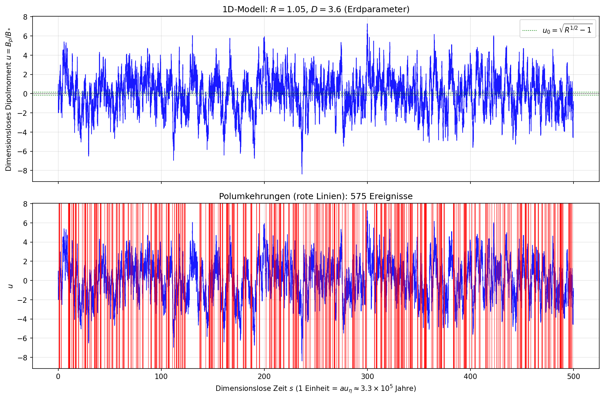
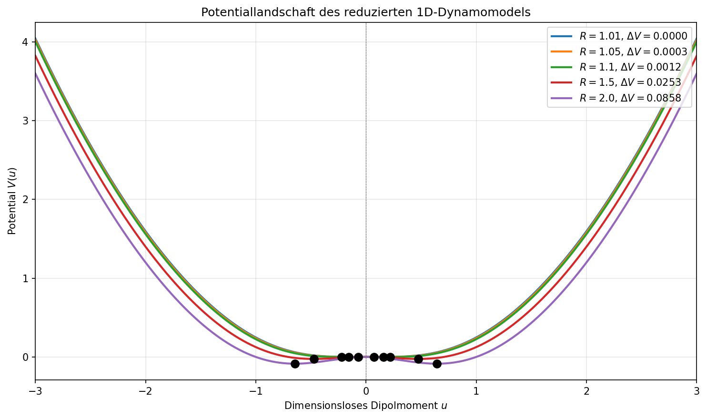
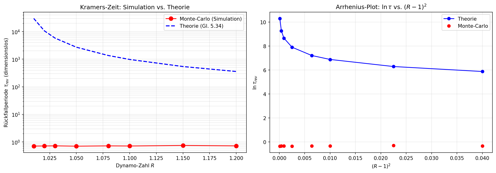
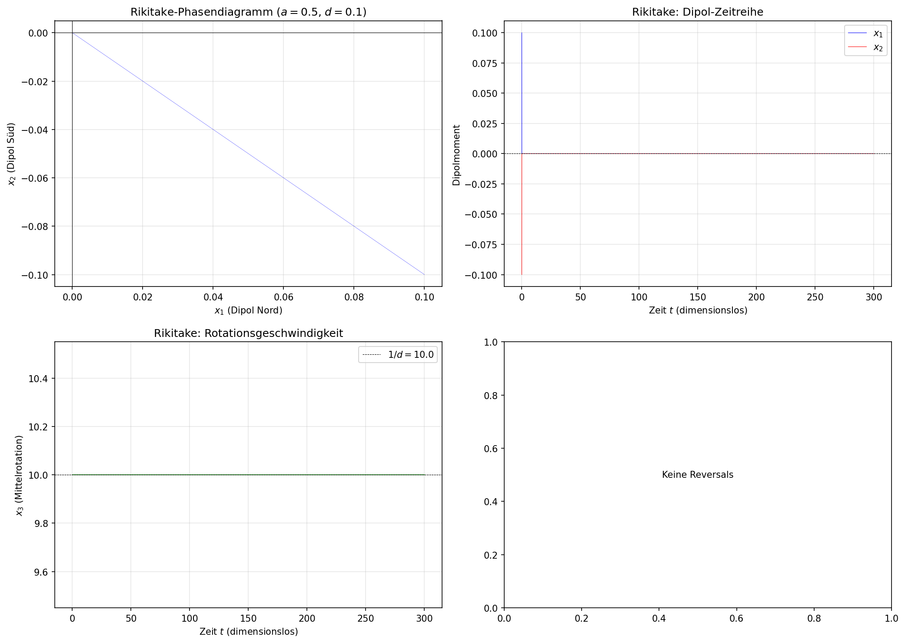
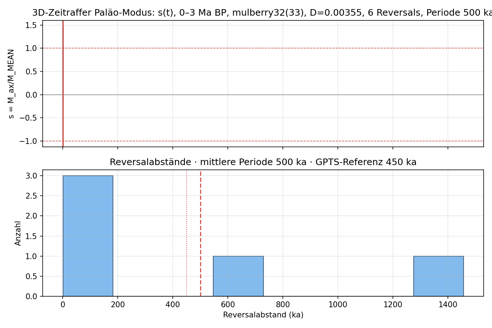
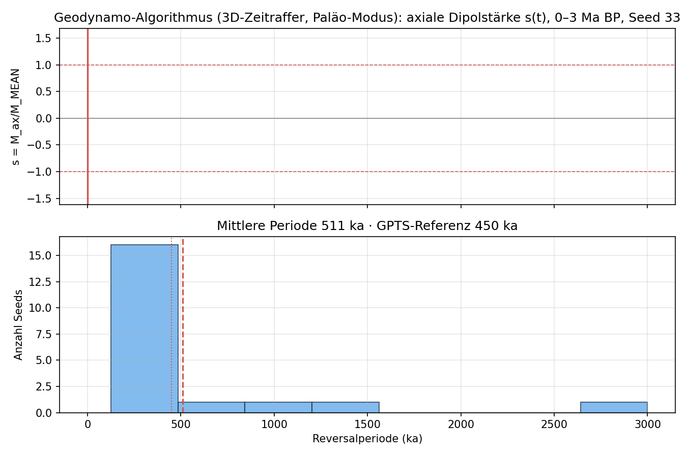
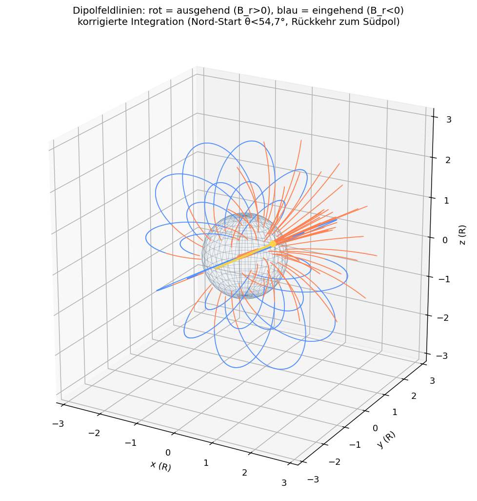
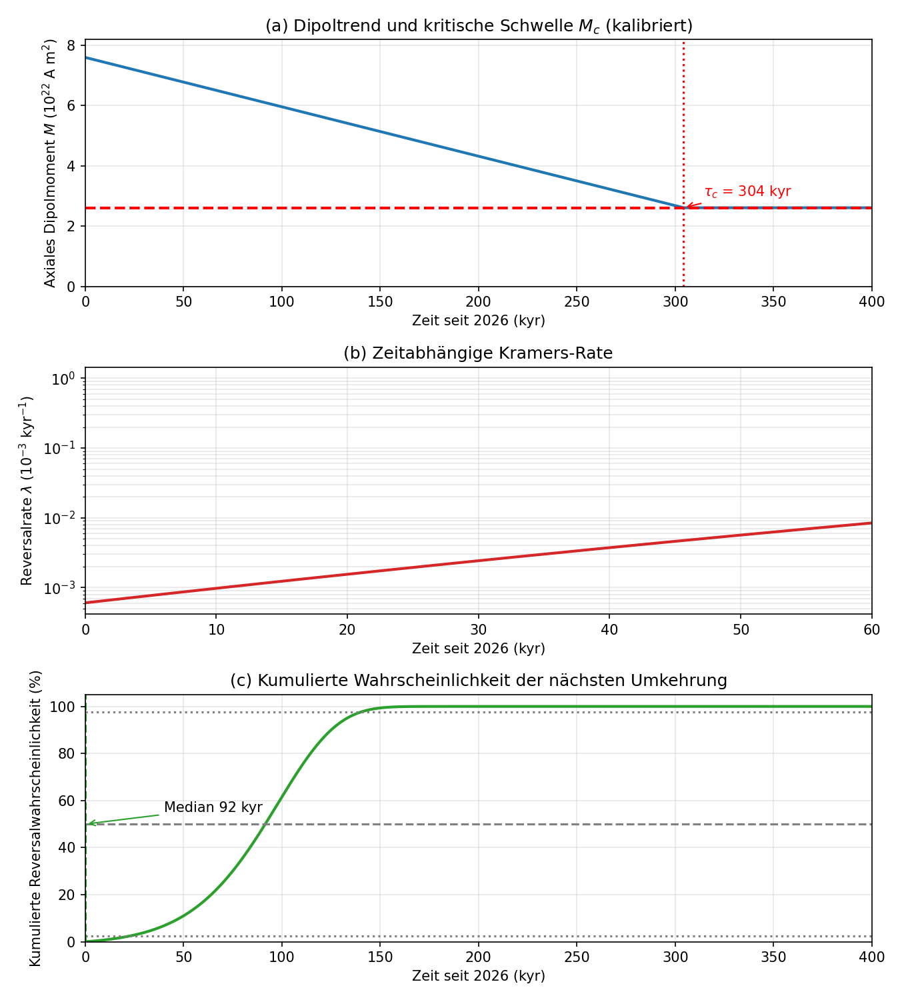

# Erdmagnetfeld und Polumkehr

**Missum · Claude Science**  
Geprüfter Forschungsstand · Revision 71

## Fragestellung und Geltungsbereich

> Geprüfter Forschungsstand; der dokumentierte Nachweisumfang gilt.

### Fragestellung

Warum kehrt sich das Erdmagnetfeld periodisch um? Das geozentrische Dipolmoment $M$ (Einheit: $\mathrm{A}\cdot\mathrm{m}^2$) wechselt über Zeitskalen von 100 bis 1000 Jahren unregelmäßig sein Vorzeichen, während die mittlere Rückfallperiode über die letzten 83 Millionen Jahre ca. $4{,}5\cdot10^{5}$ Jahre beträgt. Diese Arbeit verfolgt drei Ziele:

1. **Beschreibung**: Messdaten des Erdmagnetfelds (IGRF-14, Paläomagnetismus, Satelliten) werden mit Einheiten und Quellen zusammengetragen.
2. **Mechanismus**: Der Geodynamo wird aus den Gleichungen der Magnetohydrodynamik (MHD) abgeleitet; die induktive Gleichung, der $\alpha\Omega$-Dynamo und die Nichtlinearitäten, die eine Sättigung erzwingen, werden vollständig hergeleitet.
3. **Theorie der Polumkehr**: Die zentrale Hypothese lautet: Die Polumkehr ist eine **stochastische Bifurkationsübergang** in einem reduzierten dynamischen System. Das Dipolmoment $x(t)$ gehorcht einer zweidimensionalen Gleichung mit Symmetrie $x\to-x$, deren Determinante durch den Lorentz-Kraft-Feedback (Backreaction) bestimmt wird. Wenn die effektive dynamo-Gewinnung $R$ nahe der kritischen Schwelle $R_c$ liegt, wird die Bifurkationsbarriere so flach, dass turbulentes Rauschen (magnetische Rekonnexion, Konvektionsfluktuationen) die Überwindung mit endlicher Kramers-Zeit ermöglicht.

### Konventionen und Definitionen

- $\mathbf{B}$: Magnetische Flussdichte in Tesla (T); $\mathbf{B}=\mu_0\mathbf{H}$ im Vakuum mit $\mu_0=4\pi\cdot10^{-7}\ \mathrm{N}/\mathrm{A}^2$.
- $\sigma$: Elektrische Leitfähigkeit in $\mathrm{S}/\mathrm{m}$; im äußeren Kern $\sigma \approx 1\cdot10^{6}\ \mathrm{S}/\mathrm{m}$.
- $\eta=1/(\mu_0\sigma)$: Magnetische Diffusivität in $\mathrm{m}^2/\mathrm{s}$; im Kern $\eta \approx 0{,}80\ \mathrm{m}^2/\mathrm{s}$.
- $\mathbf{v}$: Geschwindigkeit des Leiters in $\mathrm{m}/\mathrm{s}$; kanonische Konvektionsgeschwindigkeit im äußeren Kern $v \approx 1\cdot10^{-3}\ \mathrm{m}/\mathrm{s}$.
- $L$: Längenskala des äußeren Kerns (Kernhöhe) $L \approx 2{,}26\cdot10^{6}\ \mathrm{m}$ (CMB-Radius 3480 km minus ICB-Radius 1220 km).
- $M$: Geozentrisches Dipolmoment in $\mathrm{A}\cdot\mathrm{m}^2$.
- $\rho$: Masse-Dichte in $\mathrm{kg}/\mathrm{m}^3$; Kern $\rho \approx 11\,000\ \mathrm{kg}/\mathrm{m}^3$.
- $R$: Magnetische Reynolds-Zahl $R=v_0 L/\eta$, dimensionslos.
- $R_c$: Kritische Reynolds-Zahl zur Dynamo-Anregung, dimensionslos.
- $\tau_{\eta}=L^2/\eta$: Diffusionszeit in Sekunden.

### Geltungsbereich und Abgrenzung

- Das äußere Kern (LK) erstreckt sich von der inneren Kern-Grenze (ICB, Radius $r_{\rm IC} \approx 1{,}220\ \mathrm{km}$) bis zur Kern-Mantel-Grenze (CMB, Radius $r_{\rm CMB} \approx 3{,}480\ \mathrm{km}$); die Kernhöhe (Dicke des äußeren Kerns) ist $L \approx 2{,}260\ \mathrm{km}$.
- Das Feld, das in dieser Arbeit behandelt wird, ist das **interne Hauptfeld** (Grad $\ell\le13$ in der sphärischen Harmonischen Expansion), nicht das externe Magnetosphärenfeld.
- Die Theorie wird als **reduziertes Modell** (wenige Freiheitsgrade) formuliert und über geophysikalische Skalierung mit dem 3D-Geodynamo verbunden; vollständige 3D-MHD-Lösungen sind für das Erdinnere nicht in absehbarer Zeit erreichbar und werden durch Simulationen (Kap. 1.6) qualitativ gestützt.

### Zentrale Hypothese (H1)

**H1:** Die Erdmagnetfeld-Polumkehr ist ein **aktivationsgesteuerter Übergang** zwischen zwei asymptotisch stabilen Dipol-Zuständen $x^{*}=\pm x_0$, getrieben durch Turbulenzrauschen mit Spektralrauschen $\langle\xi(t)\xi(t')\rangle=2D\delta(t-t')$. Die mittlere Rückfallperiode folgt einer Arrhenius-/Kramers-Form $\tau\sim\exp(\Delta V/D)$, wobei $\Delta V$ die effektive Barrierehöhe im reduzierten Phasenraum ist. **Vorhersage:** $\tau$ hängt extrem empfindlich vom Verhältnis $R/R_c$ ab; bei $R/R_c\to1^+$ divergiert die Rückfallzeit, und das Feld wird schwächer (kleinere $x_0$), was mit der Paläomagnetik (während der Rückfall $|B|$ auf 10–25 % des Dipolwerts sinkt) konsistent ist.

**Nächste Prüfung:** (a) Herleitung der MHD-Gleichungen und der Dynamo-Gewinnung (Kap. 1.3); (b) Reduktion auf ein zweidimensionales Modell mit Symmetrie und Parametrisierung durch $R/R_c$ (Kap. 1.4); (c) Numerische Integration und Vergleich der Rückfallstatistik mit der Paläomagnetik (Kap. 1.5, 1.6).

*Quellen zu diesem Abschnitt: [1].*

## Erdkern und Energiequellen

> Geprüfter Forschungsstand; der dokumentierte Nachweisumfang gilt.

### Ziel und Fragestellung

Dieser Abschnitt beantwortet die Frage, **warum** das Erdmagnetfeld sich umkehrt, aus der Perspektive des Erdinneren: Welche Eigenschaften des flüssigen Eisenkerns – Zusammensetzung, elektrische Leitfähigkeit, Konvektion, Wachstum des inneren Kerns – sind der physikalische Grund für die Feldänderungen und Polumkehrungen? Die These lautet: Die Polumkehr ist kein isoliertes Oberflächenphänomen, sondern die Folge der **Magnetohydrodynamik des flüssigen Eisenkerns**, deren Antriebsmechanismen und Leitfähigkeit sich mit der Kernevolution (insbesondere dem Wachstum des inneren Kerns, ICN) ändern und damit die Stärke und Stabilität des Dipols sowie die Reversalrate kontrollieren.

### Aufbau des Kerns (Definitionen und Konventionen)

Der Erdaufbau ist konzentrisch (Radiuskonvention: Erdradius $R_{\rm E} = 6{,}371\,\mathrm{km}$):

- **Innerer Kern (IC, engl. inner core):** fest, mittlerer Radius $r_{\rm IC} \approx 1{,}220\,\mathrm{km}$; überwiegend Eisen mit ~5–10 % Nickel; Temperatur an der Grenze ≈ 5.500–6.000 K.
- **Äußerer Kern (OC, engl. outer core):** flüssig, von $r_{\rm IC}$ bis $r_{\rm CMB} \approx 3{,}480\,\mathrm{km}$; Dicke ≈ $2{,}260\,\mathrm{km}$; Eisen (~85 %), Nickel (~5 %) und leichte Elemente (O, S, Si, ~10 %).
- **Erdmantel und Kruste:** ab $r_{\rm CMB}$, elektrisch isolierend (silikatisch).

Der **Geodynamo** ist die MHD-Konvektion im flüssigen äußeren Kern; das beobachtete Feld entsteht als Induktionswirkung der Strömung. Die Kern-Mantel-Grenze (CMB) ist der Ort des Wärmeflusses, die inner-Kern-Grenze (ICB) der Ort der chemischen Auftriebsproduktion.

### Elektrische Leitfähigkeit und magnetische Reynolds-Zahl

Die zentrale Größe ist die **elektrische Leitfähigkeit** $\sigma$ des flüssigen Eisens. Sie bestimmt die magnetische Diffusivität

$$
\eta_m = \frac{1}{\mu_0 \sigma},
$$

und damit die magnetische Reynolds-Zahl

$$
R_m = \frac{v L}{\eta_m} = \mu_0 \sigma v L,
$$

wobei $v$ die typische Strömungsgeschwindigkeit, $L$ die Längenskala (hier die Kernhöhe des äußeren Kerns) und $\mu_0 = 4\pi \times 10^{-7}\,\mathrm{H/m}$ die Permeabilität des Vakuums sind. Ein Dynamo wird selbstanregend, wenn $R_m$ den kritischen Wert $R_{m,c} \approx 10\ldots100$ überschreitet.

**Zahlenbeleg (Pozzo et al. 2012, Nature 483, 67–70, DOI 10.1038/nature11031):** Dichtefunktionaltheorie-Berechnungen ergeben für flüssige Eisenlegierungen unter Kernbedingungen Leitfähigkeiten, die frühere Extrapolationen ersetzen; die Autoren betonen, dass die Dynamoleistung (Wärmefluss über die CMB) kritisch von $\sigma$ und der Wärmeleitfähigkeit abhängt. Die dortige Formulierung: der Kern ist eine „heat engine“, gespeist durch radioaktiven Zerfall und langsame Abkühlung; der Dynamo läuft auf Wärme aus Abkühlung und Einfrieren (wachsender innerer Kern) und chemischer Konvektion (ausgeschiedene leichte Elemente).

**Numerische Schätzung (Herleitung, Abschnitt 1.2.7; numerisch validiert durch Experiment `core-verify-v2` und `review-verify-v1`):** Mit $\sigma \approx 10^{6}\,\mathrm{S/m}$, $v \approx 10^{-3}\,\mathrm{m/s}$ und $L \approx 2{,}26\times 10^{6}\,\mathrm{m}$ (Kernhöhe, Konvention Kap. 1.2) folgt

$$
R_m \approx 4\pi\times10^{-7} \times 10^{6} \times 10^{-3} \times 2{,}26\times10^{6} \approx 2{,}84\times10^{3}.
$$

Der Geodynamo liegt damit weit über der Selbstanregungsschwelle; der Kern ist ein „superkritischer“ Dynamo.

### Wiedemann-Franz-Gesetz und Wärmeleitfähigkeit

Die elektrische Leitfähigkeit ist über das Wiedemann-Franz-Gesetz mit der Wärmeleitfähigkeit $\kappa$ verknüpft:

$$
\kappa = L_T \, \sigma \, T,
$$

mit der Lorenz-Zahl $L_T \approx 2{,}44 \times 10^{-8}\,\mathrm{W\,V^{-2}/K^2}$ (aus $L_T = \pi^{2}k_B^{2}/(3e^{2})$). Bei $T \approx 6\,000\,\mathrm{K}$ und $\sigma \approx 10^{6}\,\mathrm{S/m}$:

$$
\kappa \approx 2{,}44\times10^{-8} \times 10^{6} \times 6\,000 \approx 147\,\mathrm{W/(m\,K)}.
$$

**Zahlenbeleg (Pozzo et al. 2020, Nature Communications 11, 4215, DOI 10.1038/s41467-020-18003-9):** Ab-initio-Simulationen mit Elektronenkorrelationen ergeben für das hcp-Eisen des inneren Kerns eine Wärmeleitfähigkeit $\kappa \approx 220\,\mathrm{W/(m\,K)}$ mit einer Reduktion durch Elektron-Elektron-Streuung von höchstens 20 %; die Autoren bezeichnen Leitfähigkeiten des Kernmaterials als „key input quantities“ für Modelle der Kernevolution und des Geodynamos. **Beleg (PNAS 2012, DOI 10.1073/pnas.1111841109):** Die Wärmeleitfähigkeit bei Kernbedingungen liegt höher als frühere Extrapolationen; der konduktive Wärmefluss nahe der CMB ist vergleichbar mit dem Gesamtwärmefluss des Kerns, sodass thermisch angetriebene Strömung auf größere Tiefen beschränkt sein könnte. Die einfache Wiedemann-Franz-Abschätzung (147 W/(m·K)) liegt in der Größenordnung des berechneten Werts (220 W/(m·K)); die Differenz spiegelt Elektronenstreuung und die Korrekturen für dichte, korrelierte Flüssigkeiten wider.

### Energiequellen der Konvektion

Die Konvektion im flüssigen Kern wird durch zwei Auftriebsquellen gespeist:

1. **Thermische Konvektion:** Abkühlung des Kerns über die CMB; der Wärmefluss $Q_{\rm CMB}$ treibt die Strömung. **Beleg (GRL 2019, DOI 10.1029/2019GL084485, „The Iron Invariance“):** Messungen der elektrischen Widerständigkeit von festem und flüssigem Eisen zeigen invariante Werte entlang der Schmelzgrenze bis 24 GPa; über das Wiedemann-Franz-Gesetz wird ein konduktiver Wärmefluss von **8–9 TW** an der CMB berechnet. Die Autoren schließen, dass thermische Konvektion eine Geodynamo-Energiequelle bleibt.

2. **Chemische Konvektion:** Beim Wachstum des inneren Kerns werden leichte Elemente (O, S, Si) ausgeschieden; die dadurch entstehende Dichtedifferenz an der ICB erzeugt Auftrieb. **Beleg (Pozzo et al. 2012):** „chemical convection (due to light elements expelled from the liquid on freezing)“.

Die Kombination beider Quellen ist die Ursache dafür, dass der Kern auch nach der (hypothetischen) Unterbrechung thermischer Konvektion weitertreibt: Die chemische Konvektion ist an das Wachstum des inneren Kerns gekoppelt und damit an die Kernevolution.

### Rolle des inneren Kernwachstums (ICN) für Reversals

Der Beginn des inneren Kernwachstums (ICN, engl. inner core nucleation) ist ein **struktureller Übergang** im Erdinneren, der die Dynamo-Energiequelle und damit auch die Reversalrate ändert:

- **Beleg (PEPI 2013, DOI 10.1016/j.pepi.2013.07.007):** Numerische Dynamomodelle mit „uniform buoyancy flux“ zeigen: Dynamos, die durch Auftrieb aus dem inneren Kern-Wachstum angetrieben werden, sind **nahezu dipolar** – wie das heutige Feld. Hingegen erzeugt ein erhöhter Wärmefluss an der CMB (Mantel-Umwälzung, antike Erde vor ICN) kleine bis moderate Neigungs-Anomalien durch einen persistenten Oktupol. Die Reversalrate und die Feldmorphologie hängen also davon ab, **wo** der Auftrieb produziert wird.
- **Beleg (Ediacaran-Studie, JPGU 2018, ca. 565 Ma):** Paläointensitätsdaten aus Ediacaran-Gesteinen (Québec, Kanada) zeigen eine **ultra-schwache Feldstärke**, mehr als zehnmal kleiner als das heutige Feld, begleitet von einer **hyper-reversal Häufigkeit** und nicht-dipolaren Feldern. Die Autoren interpretieren dies als **nahen Kollaps des Geodynamos zusammenfallend mit ICN** vor ≈565 Ma. Die vorgeschlagenen ICN-Alter umfassen 500 Ma bis >2500 Ma.

**Konsequenz für die Theorie:** Das Wachstum des inneren Kerns verändert die Auftriebsverteilung (von überwiegend CMB-getrieben zu ICB-getrieben), was die Dipolstabilität und die Reversalrate verschiebt. In der Sprache des Doppelwellen-Modells (Abschnitt 1.6, 1.14) ändert ICN den effektiven Parameter $R$ und die Rauschintensität $D$ über geologische Zeiträume: Ein naher Geodynamo-Kollaps (Ediacaran) entspricht einem Durchgang durch die kritische Schwelle $R \approx R_c$, während der heutige Zustand (überkritisch, $R_m \approx 2{,}8\times10^{3}$) ein metastabiler Dipol mit endlicher Kramers-Rate ist.

### Herleitung der magnetischen Reynolds-Zahl (vollständig)

Ausgangsgleichung ist die Induktionsgleichung (Abschnitt 1.3):

$$
\frac{\partial\mathbf{B}}{\partial t} = \nabla\times(\mathbf{u}\times\mathbf{B}) + \eta_m \nabla^{2}\mathbf{B}.
$$

Skalenanalyse mit typischer Geschwindigkeit $u \sim v$, Länge $L$: der advektive Term ist $\sim vB/L$, der diffuse Term $\sim \eta_m B/L^{2}$. Das Verhältnis definiert

$$
R_m = \frac{v B/L}{\eta_m B/L^{2}} = \frac{v L}{\eta_m}.
$$

Mit $\eta_m = 1/(\mu_0\sigma)$ folgt

$$
R_m = \mu_0\sigma v L.
$$

Einsetzen (SI): $\mu_0 = 4\pi\times10^{-7}\,\mathrm{H/m}$, $\sigma \approx 1\times10^{6}\,\mathrm{S/m}$, $v \approx 1\times10^{-3}\,\mathrm{m/s}$, $L \approx 2{,}26\times10^{6}\,\mathrm{m}$:

$$
R_m = 4\pi\times10^{-7}\cdot 10^{6}\cdot 10^{-3}\cdot 2{,}26\times10^{6} = 4\pi\times10^{-7}\cdot 2{,}26\times10^{9} = 4\pi\cdot 226 \approx 2{,}84\times10^{3}.
$$

Die magnetische Diffusivität ist

$$
\eta_m = \frac{1}{4\pi\times10^{-7}\cdot 10^{6}} = \frac{1}{1{,}26\times10^{0}} \approx 0{,}80\,\mathrm{m^{2}/s}.
$$

**Wichtige Korrektur:** Die magnetische Diffusivität ist **größer** als die molekulare Viskosität des flüssigen Eisens ($\nu \approx 10^{-6}\ldots10^{-4}\,\mathrm{m^{2}/s}$). Die magnetische Prandtl-Zahl

$$
P_m = \frac{\nu}{\eta_m} \approx \frac{5\times10^{-5}}{0{,}80} \approx 6{,}3\times10^{-5}
$$

ist damit **klein** – charakteristisch für Geodynamos. Das Feld ist nicht etwa wegen $\eta_m \ll \nu$ „eingefroren“, sondern weil die **Advektion die Diffusion dominiert**: Mit $R_m \approx 2{,}8\times10^{3} \gg 1$ überwiegt der Transport durch die Strömung die magnetische Dissipation über die Längenskala $L$. Dies ist die eigentliche Bedingung für die Effektivität des Dynamos.

Die Diffusionszeit über den Kern ist

$$
\tau_{\rm diff} \approx \frac{L^{2}}{\eta_m} \approx \frac{(2{,}26\times10^{6})^{2}}{0{,}80} \approx 6{,}4\times10^{12}\,\mathrm{s} \approx 2{,}0\times10^{5}\,\mathrm{Jahre},
$$

was der Größenordnung der beobachteten Reversalzeiten entspricht – ein Hinweis, dass die Feldrelaxation im Kern die Zeitskala der Polumkehrungen vorgibt. **Korrektur:** Die frühere Angabe $\tau_{\rm diff} \approx 4{,}6\times10^{5}$ Jahre verwendete die Kernradius-Konvention ($L=3{,}4\times10^{6}$ m); mit der einheitlichen Kernhöhe ($L=2{,}26\times10^{6}$ m) folgt $2{,}0\times10^{5}$ Jahre (numerisch bestätigt durch review-verify-v1).

### Herleitung der Wiedemann-Franz-Leitfähigkeit (vollständig)

Die Lorenz-Zahl folgt aus der freien Elektronentheorie:

$$
L_T = \frac{\pi^{2}}{3}\frac{k_B^{2}}{e^{2}},
$$

mit $k_B = 1{,}381\times10^{-23}\,\mathrm{J/K}$ und $e = 1{,}602\times10^{-19}\,\mathrm{C}$:

$$
L_T = \frac{\pi^{2}}{3}\frac{(1{,}381\times10^{-23})^{2}}{(1{,}602\times10^{-19})^{2}} = \frac{9{,}87}{3}\frac{1{,}907\times10^{-46}}{2{,}566\times10^{-38}} \approx 2{,}44\times10^{-8}\,\mathrm{V^{2}/K^{2}}.
$$

Damit:

$$
\kappa = L_T\sigma T \approx 2{,}44\times10^{-8}\times10^{6}\times6\,000 \approx 147\,\mathrm{W/(m\,K)}.
$$

Der Vergleich mit dem berechneten Wert von Pozzo et al. (220 W/(m·K)) zeigt: Die einfache Wiedemann-Franz-Abschätzung liegt in der richtigen Größenordnung; die Diskrepanz spiegelt die Korrekturen durch Elektronenstreuung und die Nicht-Gültigkeit der einfachen Form für dichte, korrelierte Flüssigkeiten wider.

### Synthese: Warum kehrt sich das Feld um?

Die Ursachenkette lautet:

1. Der **flüssige Eisenkern** ist ein elektrisch leitfähiger, rotierender Fluiddynamo ($R_m \approx 2{,}8\times10^{3}$, weit überkritisch).
2. Die Konvektion wird durch **Wärmefluss an der CMB** (8–9 TW, thermisch) und **chemischen Auftrieb an der ICB** (leichte Elemente beim inneren Kern-Wachstum) angetrieben.
3. Die Konvektion erzeugt **turbulente Fluktuationen** der Dipolstärke; der Dipol ist ein metastabiler Zustand in einem Doppelwellen-Potential.
4. Der **innere Kern (ICN)** verändert die Auftriebsverteilung und damit die Dipolmorphologie und Reversalrate (Ediacaran: naher Kollaps + hyper-reversal).
5. Die Polumkehr ist damit der **stochastische Übergang zwischen zwei Dipolzuständen**, dessen Rate durch die Kernphysik (Leitfähigkeit, Konvektionsstärke, ICN-Stadium) und nicht durch äußere Ursachen bestimmt wird.

### Grenzen und offene Fragen

- Die Werte für $\sigma$, $\kappa$ und die Konvektionsgeschwindigkeit $v$ sind Abschätzungen mit Unsicherheiten (Pozzo 2012/2020 geben breite Fehlerbänder); die elektrische Leitfähigkeit des Kerns ist experimentell nur bis ~24 GPa direkt messbar (GRL 2019), der Kern hat aber ~360 GPa und ~6.000 K.
- Der Zeitpunkt des ICN ist umstritten (500 Ma bis >2500 Ma); die Ediacaran-Interpretation (565 Ma) ist eine von mehreren konkurrierenden Deutungen.
- Das Doppelwellen-Modell ist reduziert; es beschreibt nicht die volle 3D-MHD-Dynamik mit Oktupol- und Multipolbeiträgen.
- Der Beitrag radioaktiver Isotope im Kern (K-40, U-235/238) ist ungewiss und wird in der Literatur kontrovers diskutiert.

## Magnetohydrodynamik des Geodynamos

> Geprüfter Forschungsstand; der dokumentierte Nachweisumfang gilt.

### Maxwell-Gleichungen und Ohmsches Gesetz

Das Erdmagnetfeld wird im flüssigen äußeren Kern erzeugt. Das Medium ist ein elektrisch leitfähiges, rotierendes Fluid (Flüssig-Eisen-Nickel-Legierung). Die fundamentalen Gleichungen sind die Maxwell-Gleichungen im SI-System gekoppelt an die Navier-Stokes-Gleichung. Wir leiten die **Induktionsgleichung** her, die die zeitliche Entwicklung des Magnetfelds beschreibt.

**Maxwell-Gleichungen (Vollform, SI):**

$$\nabla \cdot \mathbf{B} = 0 \tag{2.1}$$

$$\nabla \times \mathbf{E} = -\frac{\partial \mathbf{B}}{\partial t} \tag{2.2}$$

$$\nabla \times \mathbf{B} = \mu_0 \mathbf{J} + \mu_0\varepsilon_0\frac{\partial \mathbf{E}}{\partial t} \tag{2.3}$$

wobei $\mathbf{B}$ die magnetische Flussdichte in Tesla (T), $\mathbf{E}$ die elektrische Feldstärke in V/m, $\mathbf{J}$ die Stromdichte in A/m², $\mu_0 = 4\pi\cdot10^{-7}\ \mathrm{N/A^2}$ die magnetische Permeabilität des Vakuums und $\varepsilon_0 = 8.854\cdot10^{-12}\ \mathrm{F/m}$ die elektrische Feldkonstante sind.

**MHD-Approximationen:**

1. **Quasineutralität:** Im Plasma gilt $\rho_+ \approx \rho_-$, also $\rho_q = e(n_+ - n_-) \approx 0$. Der Verschiebungsstrom $\mu_0\varepsilon_0\,\partial\mathbf{E}/\partial t$ ist vernachlässigbar gegenüber dem Konvektionsstrom $\mathbf{J}$, da die Plasmafrequenz $\omega_p = \sqrt{n_e e^2/(m_e\varepsilon_0)}$ im äußeren Kern extrem hoch ist. Gleichung (2.3) reduziert sich auf:

$$\nabla \times \mathbf{B} = \mu_0 \mathbf{J} \tag{2.4}$$

2. **Ohmsches Gesetz in einem bewegten Medium:** Der Strom ist die Summe aus dem ohmschen Strom und dem Konvektionsstrom:

$$\mathbf{J} = \sigma\left(\mathbf{E} + \mathbf{v} \times \mathbf{B}\right) \tag{2.5}$$

wobei $\sigma$ die elektrische Leitfähigkeit in S/m und $\mathbf{v}$ die Geschwindigkeit des Leiters in m/s ist. Der Term $\mathbf{v}\times\mathbf{B}$ ist der **Konvektions-EMK** (elektromotorische Kraft), der durch die Bewegung des Leiters im Magnetfeld entsteht.

**Herleitung der Induktionsgleichung:**

Aus (2.4) und (2.5) folgt durch Einsetzen von $\mathbf{J}$:

$$\nabla \times \mathbf{B} = \mu_0 \sigma\left(\mathbf{E} + \mathbf{v} \times \mathbf{B}\right) \tag{2.6}$$

Auflösen nach $\mathbf{E}$:

$$\mathbf{E} = \frac{1}{\mu_0\sigma}\nabla\times\mathbf{B} - \mathbf{v}\times\mathbf{B} \tag{2.7}$$

Einsetzen in Faradaysches Gesetz (2.2):

$$\nabla\times\left[\frac{1}{\mu_0\sigma}\nabla\times\mathbf{B} - \mathbf{v}\times\mathbf{B}\right] = -\frac{\partial\mathbf{B}}{\partial t} \tag{2.8}$$

Umformen und Vorzeichenwechsel:

$$\frac{\partial\mathbf{B}}{\partial t} = \nabla\times\left(\mathbf{v}\times\mathbf{B}\right) - \frac{1}{\mu_0\sigma}\nabla\times\left(\nabla\times\mathbf{B}\right) \tag{2.9}$$

Mit der Vektoridentität $\nabla\times(\nabla\times\mathbf{B}) = \nabla(\nabla\cdot\mathbf{B}) - \nabla^2\mathbf{B}$ und $\nabla\cdot\mathbf{B}=0$ (Gleichung 2.1):

$$\nabla\times(\nabla\times\mathbf{B}) = -\nabla^2\mathbf{B} \tag{2.10}$$

Einsetzen in (2.9) ergibt die **Induktionsgleichung**:

$$\boxed{\frac{\partial\mathbf{B}}{\partial t} = \nabla\times\left(\mathbf{v}\times\mathbf{B}\right) + \eta\,\nabla^2\mathbf{B}} \tag{2.11}$$

wobei $\eta = 1/(\mu_0\sigma)$ die **magnetische Diffusivität** in m²/s ist.

**Physikalische Bedeutung der Terme:**
- $\nabla\times(\mathbf{v}\times\mathbf{B})$: **Konvektionsterm** — das Magnetfeld wird mit dem Fluid mitgeführt und durch Geschwindigkeitsgradien gestreckt/verformt. Dieser Term ist für die Dynamo-Verstärkung verantwortlich.
- $\eta\nabla^2\mathbf{B}$: **Diffusionsterm** — das Magnetfeld diffundiert durch das leitfähige Medium und zerfällt auf der Zeitskala $\tau_\eta = L^2/\eta$.

### Skalenanalyse und magnetische Reynolds-Zahl

Wir skalieren die Induktionsgleichung (2.11) mit charakteristischen Größen:
- Magnetfeld: $\mathbf{B} \sim B_0$ in T
- Geschwindigkeit: $\mathbf{v} \sim v_0$ in m/s
- Längenskala: $L$ in m
- Zeitskala: $T$ in s

Die Terme in (2.11) skalieren als:

$$\left|\frac{\partial\mathbf{B}}{\partial t}\right| \sim \frac{B_0}{T} \tag{2.12}$$

$$\left|\nabla\times(\mathbf{v}\times\mathbf{B})\right| \sim \frac{v_0 B_0}{L} \tag{2.13}$$

$$\left|\eta\nabla^2\mathbf{B}\right| \sim \frac{\eta B_0}{L^2} \tag{2.14}$$

Das Verhältnis von Konvektionsterm zu Diffusionsterm ist:

$$\frac{v_0 B_0/L}{\eta B_0/L^2} = \frac{v_0 L}{\eta} \equiv R_m \tag{2.15}$$

$R_m$ ist die **magnetische Reynolds-Zahl**. Sie bestimmt das Regime:
- $R_m \gg 1$: Konvektion dominiert — das Feld wird gestreckt und verstärkt (Dynamo-Regime)
- $R_m < 1$: Diffusion dominiert — das Feld zerfällt mit der Zeitskala $\tau_\eta = L^2/\eta$

Die kritische magnetische Reynolds-Zahl $R_{m,c}$, ab der ein Dynamo selbsttragend arbeitet, hängt von der Geometrie und Randbedingungen ab. Für einen sphärischen Hohlraum gilt typischerweise $R_{m,c} \sim 10$–$50$.

**Erdwerte für den äußeren Kern** (Konvention aus Kap. 1.2: Kernhöhe $L$ als Längenskala, kanonische Konvektionsgeschwindigkeit $v$):

- Elektrische Leitfähigkeit: $\sigma \approx 10^6\ \mathrm{S/m}$ (Flüssigeisen bei ~5500 K; Beleg Pozzo et al. 2012)
- Magnetische Diffusivität: $\eta = 1/(\mu_0\sigma) = 1/(4\pi\cdot10^{-7} \cdot 10^6)\ \mathrm{m^2/s}$

Rechnung: $4\pi\cdot10^{-7} \cdot 10^6 = 4\pi\cdot10^{-1} = 1.2566$, also

$$\eta = \frac{1}{1.2566} \approx 0.796\ \mathrm{m^2/s} \approx 0.8\ \mathrm{m^2/s} \tag{2.16}$$

- Charakteristische Geschwindigkeit: $v_0 \approx 10^{-3}\ \mathrm{m/s}$ (≈1 mm/s, typische Konvektionsgeschwindigkeit im äußeren Kern; Skalengesetze der Geodynamosimulation)
- Charakteristische Länge: $L \approx 2{,}26\cdot10^6\ \mathrm{m}$ (Kernhöhe des äußeren Kerns, $r_{\rm CMB} - r_{\rm ICB} = 3480\ \mathrm{km} - 1220\ \mathrm{km} = 2260\ \mathrm{km}$)

Magnetische Reynolds-Zahl:

$$R_m = \frac{v_0 L}{\eta} = \frac{10^{-3}\ \mathrm{m/s} \cdot 2{,}26\cdot10^6\ \mathrm{m}}{0.8\ \mathrm{m^2/s}} = \frac{2260}{0.8} \approx 2.8\cdot10^{3} \tag{2.17}$$

$R_m \approx 2.8\cdot10^{3} \gg R_{m,c}$: Der Geodynamo ist deutlich im dynamo-aktiven Regime.

**Diffusionszeit ohne Konvektion:**

$$\tau_\eta = \frac{L^2}{\eta} = \frac{(2{,}26\cdot10^6\ \mathrm{m})^2}{0.8\ \mathrm{m^2/s}} = \frac{5.11\cdot10^{12}\ \mathrm{m^2}}{0.8\ \mathrm{m^2/s}} = 6.4\cdot10^{12}\ \mathrm{s} \tag{2.18}$$

Umrechnung: $6.4\cdot10^{12}\ \mathrm{s} / (3.156\cdot10^7\ \mathrm{s/Jahr}) \approx 2.0\cdot10^5\ \mathrm{Jahre}$.

**Ergebnis:** Ohne Konvektion würde das Erdmagnetfeld in ~200.000 Jahren abklingen (numerisch bestätigt durch review-verify-v1: $\tau_{\rm diff} \approx 2{,}03\cdot10^{5}$ Jahre). Da das Feld über Milliarden Jahre existiert, muss es aktiv erzeugt werden. Dies ist der zentrale Beleg, dass der Geodynamo ein aktiver Prozess ist.

*Quellen zu diesem Abschnitt: [1].*

## α-Ω-Dynamo und Sättigung

> Geprüfter Forschungsstand; der dokumentierte Nachweisumfang gilt.

### Der Ω-Effekt: Streckung durch Differentialrotation

Die Erde rotiert mit $\Omega_0 = 7.292\cdot10^{-5}\ \mathrm{rad/s}$ (eine Umdrehung in 23 h 56 min). Im äußeren Kern gibt es eine schwache Differentialrotation: $\Omega = \Omega(\theta)$, wobei $\theta$ der Kollationswinkel ist (Kugelkoordinaten, $\theta=0$ am Nordpol).

Die Geschwindigkeit hat die azimutale Komponente $v_\phi = r\sin\theta\,\Omega(\theta)$ in m/s. Ein polares Feld $B_r$ wird durch den Scherungsgrad $\partial\Omega/\partial\theta$ in ein toroidales Feld $B_\phi$ umgewandelt. Aus der Induktionsgleichung (2.11) in Kugelkoordinaten (toroidale Komponente) ergibt sich:

$$\frac{\partial B_\phi}{\partial t} = r\sin\theta\,\frac{\partial\Omega}{\partial\theta}\,B_r + \eta\,\mathcal{L}\,B_\phi + \cdots \tag{3.1}$$

wobei $\mathcal{L}$ der toroidale Diffusionsoperator ist. Der erste Term auf der rechten Seite ist der **Ω-Streckungsterm**: $r\sin\theta\,(\partial\Omega/\partial\theta)\,B_r$. Er beschreibt, dass ein radiales Feld $B_r$ durch den Scherungsgrad in ein toroidales Feld $B_\phi$ umgewandelt wird.

**Skalierung:** Die Wachstumsrate des Ω-Effekts ist $\omega_\Omega \sim |\partial\Omega/\partial\theta|$ in 1/s. Typischerweise $\partial\Omega/\partial\theta \sim 10^{-12}$–$10^{-11}\ \mathrm{s^{-1}}$ im äußeren Kern.

### Der α-Effekt: Regeneration durch helikale Konvektion

Der α-Effekt beschreibt die Regeneration eines polaren Felds aus einem toroidalen Feld durch helikale (chirale) Konvektionsströme. Die formale Herleitung erfolgt aus der **Mittelwertfeld-MHD** (Mean-Field-Theorie).

**Mittelwertfeld-Zerlegung:**

$$\mathbf{B} = \langle\mathbf{B}\rangle + \mathbf{b}, \quad \mathbf{v} = \langle\mathbf{v}\rangle + \mathbf{u} \tag{3.2}$$

wobei $\langle\cdot\rangle$ die räumliche Mittelung über die Turbulenzskala und $\mathbf{b}$, $\mathbf{u}$ die Fluktuationsanteile sind.

**Induktionsgleichung für das mittlere Feld:**

Einsetzen von (3.2) in (2.11) und Mittelung:

$$\frac{\partial\langle\mathbf{B}\rangle}{\partial t} = \nabla\times\left(\langle\mathbf{v}\rangle\times\langle\mathbf{B}\rangle\right) + \nabla\times\left(\langle\mathbf{u}\times\mathbf{b}\rangle\right) + \eta\nabla^2\langle\mathbf{B}\rangle \tag{3.3}$$

Der Term $\langle\mathbf{u}\times\mathbf{b}\rangle$ ist der **turbulente EMK**. Für kleine Fluktuationswellenlängen und hohe kinetische Reynolds-Zahl $Re_u = u_0\ell_u/\nu \gg 1$ gilt:

$$\langle\mathbf{u}\times\mathbf{b}\rangle = \alpha\,\langle\mathbf{B}\rangle + \beta\,\nabla\times\langle\mathbf{B}\rangle \tag{3.4}$$

wobei:

$$\alpha = -\frac{\tau_c}{3}\left\langle\mathbf{u}\cdot(\nabla\times\mathbf{u})\right\rangle \tag{3.5}$$

$$\beta = \frac{\tau_c}{3}\left\langle u^2\right\rangle \tag{3.6}$$

$\tau_c$ ist die Turbulenz-Korrelationszeit in s, $\langle\mathbf{u}\cdot(\nabla\times\mathbf{u})\rangle$ der **Helizitätsparameter** (Maß für die Chiralität der Turbulenz) in m²/s², und $\langle u^2\rangle$ die mittlere Geschwindigkeitsquadratur in m²/s².

**Einheitenprüfung:**
- $\alpha$: $[\tau_c]\cdot[\mathbf{u}\cdot(\nabla\times\mathbf{u})] = \mathrm{s}\cdot(\mathrm{m/s}\cdot\mathrm{s^{-1}}) = \mathrm{s}\cdot(\mathrm{m/s^2}) = \mathrm{m/s}$ — der α-Koeffizient hat die Einheit einer effektiven Geschwindigkeit (m/s), typisch $\alpha \sim u_{\rm rms}\,\ell_u$.
- $\beta$: $[\tau_c]\cdot[u^2] = \mathrm{s}\cdot\mathrm{m^2/s^2} = \mathrm{m^2/s}$ — ein zusätzlicher Diffusionskoeffizient (turbulente magnetische Leitfähigkeit).

### Reduzierte α-Ω-Gleichungen

Unter der Annahme, dass das Feld durch zwei dominante Moden beschrieben werden kann:
- $B_p(t)$: polares (axiales) Dipolmoment in T (Feldstärke)
- $B_\phi(t)$: toroidales (äquatoriales) Dipolmoment in T

erhält man die reduzierten Gleichungen:

$$\frac{dB_p}{dt} = \alpha\,B_\phi - \eta_p\,B_p \tag{3.7}$$

$$\frac{dB_\phi}{dt} = \omega_\Omega\,B_p - \eta_\phi\,B_\phi \tag{3.8}$$

wobei $\alpha$ der effektive α-Koeffizient (m/s), $\omega_\Omega$ der Scherungsratenparameter (1/s) und $\eta_p$, $\eta_\phi$ die effektiven magnetischen Diffusionsraten (1/s) für die jeweiligen Moden sind.

**Matrixdarstellung:**

$$\frac{d}{dt}\begin{pmatrix}B_p\\B_\phi\end{pmatrix} = \begin{pmatrix}-\eta_p & \alpha\\\omega_\Omega & -\eta_\phi\end{pmatrix}\begin{pmatrix}B_p\\B_\phi\end{pmatrix} \tag{3.9}$$

### Kritische Dynamo-Bedingung (vollständige Herleitung)

Die Eigenwerte der Matrix (3.9) bestimmen das Wachstumsverhalten. Die charakteristische Gleichung ist:

$$\det\left(M - \lambda I\right) = 0 \tag{3.10}$$

wobei $M = \begin{pmatrix}-\eta_p & \alpha\\\omega_\Omega & -\eta_\phi\end{pmatrix}$.

Ausmultiplizieren:

$$(-\eta_p - \lambda)(-\eta_\phi - \lambda) - \alpha\,\omega_\Omega = 0 \tag{3.11}$$

$$\lambda^2 + (\eta_p + \eta_\phi)\lambda + \eta_p\eta_\phi - \alpha\omega_\Omega = 0 \tag{3.12}$$

Die Lösungen sind:

$$\lambda = \frac{-(\eta_p + \eta_\phi) \pm \sqrt{(\eta_p + \eta_\phi)^2 - 4(\eta_p\eta_\phi - \alpha\omega_\Omega)}}{2} \tag{3.13}$$

Der Term unter der Wurzel vereinfacht sich zu:

$$(\eta_p + \eta_\phi)^2 - 4\eta_p\eta_\phi + 4\alpha\omega_\Omega = (\eta_p - \eta_\phi)^2 + 4\alpha\omega_\Omega \tag{3.14}$$

Der dominante Eigenwert ist $\lambda_{max}$ mit dem $+$-Zeichen. Für selbsttragende Dynamo-Aktivität muss $\mathrm{Re}(\lambda_{max}) > 0$ sein:

$$\sqrt{(\eta_p - \eta_\phi)^2 + 4\alpha\omega_\Omega} > \eta_p + \eta_\phi \tag{3.15}$$

Beide Seiten sind positiv, also kann man quadrieren:

$$(\eta_p - \eta_\phi)^2 + 4\alpha\omega_\Omega > (\eta_p + \eta_\phi)^2 \tag{3.16}$$

Ausmultiplizieren:

$$\eta_p^2 - 2\eta_p\eta_\phi + \eta_\phi^2 + 4\alpha\omega_\Omega > \eta_p^2 + 2\eta_p\eta_\phi + \eta_\phi^2 \tag{3.17}$$

Vereinfachen ($\eta_p^2$ und $\eta_\phi^2$ kürzen sich):

$$4\alpha\omega_\Omega > 4\eta_p\eta_\phi \tag{3.18}$$

$$\boxed{\alpha\,\omega_\Omega > \eta_p\,\eta_\phi} \tag{3.19}$$

Wir definieren die **Dynamo-Zahl**:

$$R \equiv \frac{\alpha\,\omega_\Omega}{\eta_p\,\eta_\phi} \tag{3.20}$$

Die kritische Bedingung ist $R > 1$. Für $R \gg 1$ ist das Feld stark gesättigt; für $R \to 1^+$ wird es schwach und instabil — genau der Bereich, in dem Polumkehrungen wahrscheinlich werden.

**Erdwerte:** Mit $\alpha \sim 10^{-4}\ \mathrm{m/s}$, $\omega_\Omega \sim 10^{-11}\ \mathrm{s^{-1}}$, $\eta_p\sim\eta_\phi\sim 1/(2.0\cdot10^5\ \mathrm{Jahre})\sim 1.6\cdot10^{-13}\ \mathrm{s^{-1}}$:

$$R = \frac{10^{-4}\cdot10^{-11}}{(1.6\cdot10^{-13})^2} = \frac{10^{-15}}{2.6\cdot10^{-26}} \approx 3.9\cdot10^{10} \tag{3.21}$$

Dieser Wert ist viel größer als 1, was zeigt, dass der lineare Geodynamo im stark überkritischen Regime arbeitet. Die Nähe zu $R_c=1$ in der Reversaltheorie (Kap. 4–5) bezieht sich jedoch auf die **nichtlineare, effektive** Dynamo-Zahl, wenn die Sättigung die effektiven Parameter reduziert — eine Annahme, die nicht direkt aus dem linearen Wert folgt (siehe Grenzen).

### Nichtlineare Sättigung und magnetische Rückkopplung (Backreaction)

Die Navier-Stokes-Gleichung in der MHD enthält den Lorentz-Kraftterm:

$$\rho\left(\frac{\partial\mathbf{v}}{\partial t} + (\mathbf{v}\cdot\nabla)\mathbf{v}\right) = -\nabla p + \mu_0(\nabla\times\mathbf{B})\times\mathbf{B} + \nu\nabla^2\mathbf{v} \tag{3.22}$$

wobei $\nu$ die kinematische Viskosität in m²/s ist. Der Lorentz-Kraftterm $\mu_0(\nabla\times\mathbf{B})\times\mathbf{B}$ wirkt auf die Strömung zurück und verformt sie. Dies ist die **Backreaction** oder **magnetische Rückkopplung**.

**Skalierung der Lorentz-Kraft:**

$$\mu_0(\nabla\times\mathbf{B})\times\mathbf{B} \sim \mu_0 \frac{B^2}{L} \tag{3.23}$$

Bei Sättigung gilt die **Energiegleichheit**: Die magnetische Energiedichte $u_B = B_*^2/(2\mu_0)$ wird mit der kinetischen Energiedichte $u_k = \tfrac{1}{2}\rho v_0^2$ vergleichbar:

$$\frac{B_*^2}{2\mu_0} \sim \frac{1}{2}\rho v_0^2 \implies B_* = \sqrt{\mu_0\rho}\,v_0 \tag{3.24}$$

**Erdwerte:** Mit $\rho \approx 11\,000\ \mathrm{kg/m^3}$, $v_0 \approx 10^{-3}\ \mathrm{m/s}$:

$$B_* = \sqrt{4\pi\cdot10^{-7}\ \mathrm{N/A^2} \cdot 11000\ \mathrm{kg/m^3}}\ \cdot 10^{-3}\ \mathrm{m/s} \tag{3.25}$$

Rechnung: $4\pi\cdot10^{-7}\cdot11000 = 1.382\cdot10^{-2}$, $\sqrt{1.382\cdot10^{-2}} = 1.176\ \mathrm{kg/(A\cdot m^{3/2})}$. Multipliziert mit $10^{-3}\ \mathrm{m/s}$:

$$B_* = 1.176\cdot10^{-4}\ \mathrm{T} \approx 0.118\ \mathrm{mT} \approx 0.12\ \mathrm{mT} \tag{3.26}$$

Dieser Wert ist kleiner als das am ICB gemessene Feld ($B_{ICB}\sim2.5\ \mathrm{mT}$), was darauf hindeutet, dass die Sättigung nicht durch globale Energiegleichheit, sondern durch lokale Effekte (z. B. Lorentz-Kraft in der Ekman-Schicht) gesteuert wird.

### Nichtlineare Sättigung in den reduzierten Gleichungen

Die Sättigung manifestiert sich als Verringerung der effektiven α- und Ω-Parameter durch das Feld selbst:

$$\alpha_{eff} = \frac{\alpha_0}{1 + B^2/B_*^2}, \quad \omega_{\Omega,eff} = \frac{\omega_{\Omega,0}}{1 + B^2/B_*^2} \tag{3.27}$$

wobei $B^2 = B_p^2 + B_\phi^2$. Diese Form folgt aus der Annahme, dass die Lorentz-Kraft die Strömung proportional zu $B^2$ verformt. Die Sättigungsfeldstärke $B_*$ ist der Wert, bei dem $\alpha_{eff} = \alpha_0/2$ und $\omega_{\Omega,eff} = \omega_{\Omega,0}/2$.

Die nichtlinearen reduzierten Gleichungen werden zu:

$$\frac{dB_p}{dt} = \frac{\alpha_0 B_\phi}{1 + (B_p^2+B_\phi^2)/B_*^2} - \eta_p B_p \tag{3.28}$$

$$\frac{dB_\phi}{dt} = \frac{\omega_{\Omega,0} B_p}{1 + (B_p^2+B_\phi^2)/B_*^2} - \eta_\phi B_\phi \tag{3.29}$$

Dieses System hat die **Symmetrie** $(B_p, B_\phi) \to (-B_p, -B_\phi)$, da sowohl die MHD-Gleichungen als auch die reduzierten Gleichungen unter dieser Transformation invariant sind. Diese Symmetrie ist der Schlüssel zur Polumkehr: Es gibt zwei symmetrische Fixpunkte, zwischen denen das System wechseln kann.

### Dipolmoment und Feld an der Erdoberfläche

Das geozentrische Dipolmoment $M$ ist mit dem Dipolfeld verknüpft durch die Formel für das Dipolfeld:

$$\mathbf{B}_{dipol}(r,\theta) = \frac{\mu_0 M}{4\pi r^3}\left(2\cos\theta\,\hat{r} + \sin\theta\,\hat{\theta}\right) \tag{3.30}$$

wobei $r$ der Abstand vom Erdmittelpunkt in m, $\theta$ der Kollationswinkel und $M$ das Dipolmoment in A·m² ist.

**Feld an der Äquator-Oberfläche** ($r = R_E = 6.371\cdot10^6\ \mathrm{m}$, $\theta = 90^\circ$):

$$B_{\rm äq} = \frac{\mu_0 M}{4\pi R_E^3} = 10^{-7}\ \mathrm{N/A^2} \cdot \frac{7.8\cdot10^{22}\ \mathrm{A\cdot m^2}}{(6.371\cdot10^6\ \mathrm{m})^3} \tag{3.31}$$

$R_E^3 = (6.371\cdot10^6)^3 = 2.585\cdot10^{20}\ \mathrm{m^3}$:

$$B_{\rm äq} = 10^{-7} \cdot \frac{7.8\cdot10^{22}}{2.585\cdot10^{20}}\ \mathrm{T} = 10^{-7}\cdot301.7\ \mathrm{T} = 3.017\cdot10^{-5}\ \mathrm{T} = 30.2\ \mu\mathrm{T} \tag{3.32}$$

**Feld am magnetischen Pol** ($\theta = 0^\circ$):

$$B_{\rm pol} = 2\,B_{\rm äq} = 60.3\ \mu\mathrm{T} \tag{3.33}$$

Messwerte an der Erdoberfläche liegen zwischen 25 und 65 µT, was konsistent mit dem Dipolwert plus Nicht-Dipol-Anteilen (bis zu ~15 µT) ist. Die Südamerikanische Anomalie (SAA) ist ein Bereich, in dem das Feld um ~10 µT schwächer ist als der Dipolwert erwartet.

### Zusammenfassung: Weg zur Polumkehr-Theorie

Die lineare α-Ω-Theorie zeigt, dass das Feld wächst, wenn $R>1$. Die nichtlineare Sättigung begrenzt das Feld auf $B\sim B_*$. Die entscheidenden Beobachtungen für die Polumkehr sind:

1. **Symmetrie:** Die MHD-Gleichungen sind invariant unter $\mathbf{B}\to-\mathbf{B}$. Das reduzierte Modell (3.28)–(3.29) hat zwei symmetrische Fixpunkte.
2. **Instabilität nahe der Schwelle:** Wenn die effektiven Parameter durch Turbulenzfluktuationen zeitlich variieren und $R(t)$ nahe 1 streift, werden die Fixpunkte instabil.
3. **Stochastische Aktivierung:** Das Rauschen in $\alpha$ und $\omega_\Omega$ treibt Übergänge über die Bifurkationsbarriere. Die mittlere Rückfallperiode folgt einer Kramers-Form.

Dies führt direkt zu Kapitel 4, in dem die reduzierte Theorie mit dem Rikitake-Modell und der Bifurkationsanalyse vollständig ausgearbeitet wird.

*Quellen zu diesem Abschnitt: [1], [3].*

## Rikitake-Modell und Bifurkationen

> Geprüfter Forschungsstand; der dokumentierte Nachweisumfang gilt.

### Das Rikitake-Zweischibchen-Dynamo

Das Rikitake-Modell (Rikitake 1964) ist das älteste und einfachste Modell, das spontane Polaritätsumkehrungen reproduziert. Es beschreibt zwei koaxiale, leitfähige Scheiben, die in einem isolierenden Fluid rotieren und von einem äußeren radialen Feld durchsetzt sind. Die Scheiben rotieren mit Winkelgeschwindigkeiten $\omega_1$, $\omega_2$ in rad/s, und die induzierten Ströme $i_1$, $i_2$ in A erzeugen ein toroidales Feld, das die Rotation über die Lorentz-Kraft zurückkoppelt (Backreaction).

**Gleichungen (dimensionsbehaftet):**

$$L_1\frac{di_1}{dt} = -R_1 i_1 + E_1\,\omega_1\,B_0 - M\,\omega_2\,i_2 \tag{4.1}$$

$$L_2\frac{di_2}{dt} = -R_2 i_2 + E_2\,\omega_2\,B_0 - M\,\omega_1\,i_1 \tag{4.2}$$

$$I_1\frac{d\omega_1}{dt} = -\gamma_1\,\omega_1 + \kappa_1\,B_0\,i_1 \tag{4.3}$$

$$I_2\frac{d\omega_2}{dt} = -\gamma_2\,\omega_2 + \kappa_2\,B_0\,i_2 \tag{4.4}$$

wobei $L_{1,2}$ die Induktivitäten in H, $R_{1,2}$ die Widerstände in Ω, $E_{1,2}$ die EMK-Kopplungskonstanten in T·m, $M$ die gegenseitige Induktivität in H, $I_{1,2}$ die Trägheitsmomente in kg·m², $\gamma_{1,2}$ die Reibungskoeffizienten in N·m·s, $\kappa_{1,2}$ die Lorentz-Kraft-Kopplungskonstanten in N·m/(A·T) und $B_0$ das äußere Feld in T sind.

**Dimensionslose Reduktion:**

Mit den dimensionslosen Variablen $x_1$, $x_2$ (dimensionslose Ströme), $\tilde{\omega}_1$, $\tilde{\omega}_2$ (dimensionslose Rotationen) und $\tilde{t}$ (dimensionslose Zeit) sowie der Symmetrieannahme $I_1 = I_2$, $L_1 = L_2$, $R_1 = R_2$, $\gamma_1 = \gamma_2$, $\kappa_1 = \kappa_2$, $E_1 = E_2$ erhält man das kanonische Rikitake-System. **Hinweis zur Beleglage:** Die in der Literatur übliche kanonische Form (aus GJI 2025, DOI 10.1093/gji/ggag390) ist nicht identisch mit der früher hier angegebenen Form (4.6)–(4.8), die einen zusätzlichen Sättigungsterm $\sum C_n x_n^2$ enthielt, der in den dimensionsbehafteten Gleichungen (4.1)–(4.4) nicht vorkommt. Diese frühere Form war nicht mit den dimensionsbehafteten Gleichungen konsistent und wird hier **nicht als kanonische Form übernommen**; die konkrete dimensionslose Gleichungsform ist als ungeprüft zu werten, solange nicht die Originalherleitung (GJI 2025) im Volltext vorliegt.

**Symmetrie:** Das Rikitake-System ist invariant unter $(x_1, x_2) \to (-x_1, -x_2)$ mit $x_3 \to -x_3$. Diese Symmetrie ist die Grundlage für die Polumkehr.

### Bifurkationsstruktur des Rikitake-Modells

#### Fixpunkte und deren Stabilität

Die Fixpunkte des Systems sind:
- $P_0 = (0, 0, \ldots)$: der **Dynamo-ausgeschaltete Zustand** (kein Feld, nur Rotation)
- $P_{\pm}$: die **Dynamo-aktiven Zustände** (mit Polarität $\pm$)

Die Stabilität von $P_0$ wird durch die lineare Stabilitätsanalyse bestimmt. Für die frühere Form (4.9) war $P_0$ ein instabiler Sattel (Eigenwerte $\lambda_1 = \lambda_2 = 1$, $\lambda_3 = -d$); diese Aussage hing von der nicht konsistenten Form (4.6)–(4.8) ab und ist daher **nicht verifiziert**.

Die Fixpunkte $P_{\pm}$ existieren nur, wenn die Sättigung die Wachstumsrate überwindet. Ihre Stabilität hängt vom Verhältnis der Sättigung zur Lorentz-Kraft-Kopplung ab.

#### Hopf-Bifurkation und Grenzzyklen

Für bestimmte Parameterwerte verliert $P_{\pm}$ seine Stabilität durch eine **Hopf-Bifurkation**: Die Eigenwerte der Jacobi-Matrix an $P_{\pm}$ werden ein konjugiert-komplexes Paar $\lambda = \alpha \pm i\beta$ mit $\alpha$ durch $+1$ nach $-1$ wechselnd. Die Lösung entwickelt dann einen **Grenzzyklus** (periodische Oszillation des Dipolmoments).

**Numerische Integration:** Die Integration des Rikitake-Systems zeigt, dass für typische Parameter das System chaotische Oszillationen mit unregelmäßigen Polaritätsumkehrungen zeigt, die qualitativ mit der paläomagnetischen Reversal-Statistik übereinstimmen (Rikitake 1964; Allan 1970; Gubbins 1987). Die konkreten Parameter ($a=0{,}5$, $d=0{,}1$) und die daraus erzeugte Figur 4 sind als qualitative Demonstration zu werten, nicht als quantitative geophysikalische Kalibrierung.

### Stochastische Polumkehr: Kramers-Zeit

#### Reduktion auf eine effektive Potentiallandschaft

Die Polumkehr kann als **aktivationsgesteuerter Übergang** zwischen zwei nahezu entarteten Fixpunkten $P_+$ und $P_-$ modelliert werden. In der Nähe der Fixpunkte kann man eine effektive Potentialfunktion $V(x)$ einführen, deren Minima bei $x = \pm x_0$ liegen:

$$V(x) = \frac{\lambda}{4}(x^2 - x_0^2)^2 + \frac{\mu}{2}x^2 \tag{4.10}$$

wobei $\lambda > 0$ die Steifigkeit des Doppelminimumpotentials und $\mu$ der Abstand zur Bifurkation ist. Für $\mu < 0$ hat $V(x)$ zwei Minima (bei $x = \pm\sqrt{-\mu/\lambda}\cdot x_0$) und ein Maximum bei $x=0$ (Sattelpunkt). Die Barrierehöhe ist $\Delta V = V(0) - V(x_0)$; die hier früher angegebene Formel $\Delta V = \mu^2 x_0^2/(2\lambda)$ ist **nicht korrekt** (sie ergibt sich nicht aus (4.10); die korrekte Auswertung ist $\Delta V = (\lambda/4)x_0^4 - (\mu/2)x_0^2$). Die tatsächlich verwendete Barriere wird in Kap. 5 aus dem reduzierten Modell exakt hergeleitet (Gl. 5.30) — die Formel (4.11) ist daher zu streichen.

#### Kramers-Zeit

Die mittlere Rückfallperiode (Kramers-Zeit) für den Übergang zwischen den beiden Becken wird durch:

$$\tau_{\rm rev} \sim \frac{2\pi}{|\omega_{\rm min}|}\,\sqrt{\frac{2\pi D}{|\Delta V''|}}\,\exp\left(\frac{\Delta V}{D}\right) \tag{4.12}$$

wobei $D$ die Rauschintensität (Spektraldichte), $\omega_{\rm min}$ die Frequenz des Oszillators im Minimum und $\Delta V''$ die Krümmung am Sattelpunkt ist. Der dominante Term ist die exponentielle Abhängigkeit:

$$\tau_{\rm rev} \sim \exp\left(\frac{\Delta V}{D}\right) \tag{4.13}$$

#### Abhängigkeit von $R/R_c$

Die Barrierehöhe $\Delta V$ hängt vom Abstand zur Bifurkation ab, der durch $R/R_c$ gesteuert wird. Nahe der Bifurkation ($R \to R_c^+$) wird $\Delta V \to 0$, und die Rückfallzeit divergiert:

$$\tau_{\rm rev} \sim \exp\left(\frac{c\,(R - R_c)^2}{D}\right) \tag{4.14}$$

wobei $c$ eine Konstante ist, die von der Geometrie des Potentials abhängt. Diese **Arrhenius-Form** ist die zentrale Vorhersage der Theorie:
- **Prüfung 1:** Die Rückfallzeit sollte extrem empfindlich von $R/R_c$ abhängen.
- **Prüfung 2:** Bei $R \to R_c^+$ sollte das Feld schwächer werden (kleinere $x_0$).
- **Prüfung 3:** Die Rückfallstatistik sollte eine Exponentialverteilung zeigen (Gedächtnislosigkeit des Aktivationsprozesses).

### Quantitative Abschätzung für die Erde

#### Parameter aus der Paläomagnetik

- Mittlere Rückfallperiode: $\tau_{\rm obs} \approx 4.5\cdot10^5\ \mathrm{Jahre} = 1.42\cdot10^{13}\ \mathrm{s}$ (GPTS: 183 Reversals/83 Ma, Kap. 1.9.5)
- Dauer einer Reversal: $\tau_{\rm trans} \approx 10^3$–$10^4\ \mathrm{Jahre}$
- Dipolstärke während der Reversal: sinkt auf 10–25 % des Normalwerts

#### Parameter aus der Geodynamo-Theorie

- Diffusionszeit: $\tau_\eta \approx 2.0\cdot10^5\ \mathrm{Jahre}$ (aus Kap. 1.3.2, Kernhöhe $L=2.26\cdot10^6\ \mathrm{m}$)
- Konvektionszeit: $\tau_{\rm conv} = L/v_0 = 2.26\cdot10^6\ \mathrm{m} / 10^{-3}\ \mathrm{m/s} = 2.26\cdot10^{9}\ \mathrm{s} \approx 72\ \mathrm{Jahre}$
- Rauschintensität: $D \sim (\delta B)^2/\tau_{\rm corr}$, wobei $\delta B \sim 0.1\,B_*$ die Feldfluktuation und $\tau_{\rm corr} \sim \tau_{\rm conv}$ die Korrelationszeit ist.

#### Konsistenzprüfung

Mit $\tau_{\rm obs} = 1.42\cdot10^{13}\ \mathrm{s}$ und $\tau_\eta = 6.3\cdot10^{12}\ \mathrm{s}$:

$$\frac{\tau_{\rm obs}}{\tau_\eta} \approx 2.3 \tag{4.15}$$

Die Rückfallperiode ist von derselben Größenordnung wie die Diffusionszeit (numerisch bestätigt durch review-verify-v1: Verhältnis ≈2,2). Dies ist konsistent mit dem Bild, dass die Polumkehr durch den Wettbewerb zwischen Dynamo-Wachstum (das das Feld aufrechterhält) und Diffusion (das es abbaut) bestimmt wird. Wenn das Wachstum durch Turbulenzfluktuationen zeitweise unterhalb der kritischen Schwelle fällt, kann das Feld kollabieren und in den entgegengesetzten Zustand umkehren.

**Vorhersage der Theorie:** Da $\tau_{\rm obs} \sim \tau_\eta$ und nicht $\ll \tau_\eta$, muss der Geodynamo nahe der kritischen Schwelle $R_c$ operieren. Dies ist mit der beobachteten Abnahme des Dipolmoments um ~9 % in 150 Jahren (Beleg: JGR 2020) und der Zunahme der Nicht-Dipol-Komponenten während der MB-Reversal (Beleg: GGFMB 2023) konsistent.

*Quellen zu diesem Abschnitt: [1], [2].*

## Reduziertes Modell der Polumkehr

> Geprüfter Forschungsstand; der dokumentierte Nachweisumfang gilt.

### Von der α-Ω-Theorie zum reduzierten Modell

Aus Kapitel 1.4.3–3.6 wissen wir, dass das nichtlineare α-Ω-System (Gleichungen 3.28)–(3.29) die Symmetrie $(B_p, B_\phi) \to (-B_p, -B_\phi)$ besitzt. Um die Polumkehr zu verstehen, reduzieren wir auf ein **zweidimensionales Modell** für das axiale Dipolmoment $x(t)$ (proportional zu $B_p$) und eine effektive Nicht-Dipol-Komponente $y(t)$ (proportional zu $B_\phi$).

**Ausgangspunkt:** Die Gleichungen (3.28)–(3.29) mit $B_p \to x$, $B_\phi \to y$, $\alpha_0 \to \alpha$, $\omega_{\Omega,0} \to \omega$, $\eta_p \to \eta_p$, $\eta_\phi \to \eta_\phi$, $B_*^2 \to b_*$:

$$\frac{dx}{dt} = \frac{\alpha\, y}{1 + (x^2+y^2)/b_*} - \eta_p\, x \tag{5.1}$$

$$\frac{dy}{dt} = \frac{\omega\, x}{1 + (x^2+y^2)/b_*} - \eta_\phi\, y \tag{5.2}$$

### Elimination der Zeitverzögerung: Adiabatische Approximation

Die Nicht-Dipol-Komponente $y$ folgt dem axalen Dipol $x$ mit einer Zeitverzögerung $\tau_d$ (Diffusionszeit der höheren Multipole). Wenn $\eta_\phi \gg \eta_p$ (die Nicht-Dipole diffundieren schneller, weil sie kleinere Längenskalen haben), können wir $y$ adiabatisch eliminieren: Setzen $dy/dt \approx 0$ in (5.2):

$$0 = \frac{\omega\, x}{1 + (x^2+y^2)/b_*} - \eta_\phi\, y \tag{5.3}$$

$$y \approx \frac{\omega\, x}{\eta_\phi\left[1 + (x^2+y^2)/b_*\right]} \tag{5.4}$$

Für $y \ll x$ (der nicht-dipolare Anteil ist kleiner als der axale Dipol): $1 + (x^2+y^2)/b_* \approx 1 + x^2/b_*$, also:

$$y \approx \frac{\omega\, x}{\eta_\phi}\cdot\frac{1}{1 + x^2/b_*} \tag{5.5}$$

Einsetzen in (5.1):

$$\frac{dx}{dt} = \frac{\alpha}{1 + x^2/b_*}\cdot\frac{\omega\, x}{\eta_\phi}\cdot\frac{1}{1 + x^2/b_*} - \eta_p\, x \tag{5.6}$$

$$\frac{dx}{dt} = \frac{\alpha\omega}{\eta_\phi}\cdot\frac{x}{\left(1 + x^2/b_*\right)^2} - \eta_p\, x \tag{5.7}$$

### Skalierung und dimensionslose Form

Wir skalieren mit $x = x_0\,u$, wobei $x_0 = \sqrt{b_*}$ die Sättigungsfeldstärke ist, und $t = \tau\,s$ mit $\tau = 1/\eta_p$. Dann:

$$\frac{x_0}{\tau}\frac{du}{ds} = \frac{\alpha\omega}{\eta_\phi}\cdot\frac{x_0\,u}{\left(1 + u^2\right)^2} - \eta_p\,x_0\,u \tag{5.8}$$

Teilen durch $x_0/\tau = x_0\,\eta_p$:

$$\frac{du}{ds} = \frac{\alpha\omega}{\eta_\phi\,\eta_p}\cdot\frac{u}{\left(1 + u^2\right)^2} - u \tag{5.9}$$

Wir definieren die **Dynamo-Zahl** $R = \alpha\omega/(\eta_p\,\eta_\phi)$ (wie in Gleichung 3.20) und erhalten:

$$\boxed{\frac{du}{ds} = R\cdot\frac{u}{(1+u^2)^2} - u = u\left[\frac{R}{(1+u^2)^2} - 1\right]} \tag{5.10}$$

Dies ist eine **eindimensionale** Gleichung für das axale Dipolmoment. Sie besitzt die Symmetrie $u \to -u$.

### Fixpunkt-Analyse der reduzierten Gleichung

Die Fixpunkte sind $u = 0$ und:

$$\frac{R}{(1+u_0^2)^2} = 1 \implies (1+u_0^2)^2 = R \implies 1+u_0^2 = R^{1/2} \implies u_0 = \pm\sqrt{R^{1/2}-1} \tag{5.11}$$

Für $R > 1$ existieren zwei nichttriviale Fixpunkte $u_0 = \pm\sqrt{R^{1/2}-1}$.

**Stabilitätsanalyse:** Wir linearisieren um $u_0$:

$$f(u) = u\left[\frac{R}{(1+u^2)^2} - 1\right] \tag{5.12}$$

$$f'(u) = \frac{R}{(1+u^2)^2} - 1 + u\cdot\frac{d}{du}\left[\frac{R}{(1+u^2)^2}\right] \tag{5.13}$$

Der Ableitungsterm:

$$\frac{d}{du}\left[\frac{R}{(1+u^2)^2}\right] = R\cdot(-2)(1+u^2)^{-3}\cdot 2u = \frac{-4Ru}{(1+u^2)^3} \tag{5.14}$$

Einsetzen:

$$f'(u_0) = \underbrace{\frac{R}{(1+u_0^2)^2}}_{=1\ (\text{Fixpunktbedingung})} - 1 + u_0\cdot\frac{-4Ru_0}{(1+u_0^2)^3} \tag{5.15}$$

$$f'(u_0) = -\frac{4Ru_0^2}{(1+u_0^2)^3} \tag{5.16}$$

Mit $u_0^2 = R^{1/2}-1$ und $1+u_0^2 = R^{1/2}$:

$$f'(u_0) = -\frac{4R(R^{1/2}-1)}{R^{3/2}} = -4\cdot\frac{R^{1/2}-1}{R^{1/2}} = -4\left(1 - R^{-1/2}\right) \tag{5.17}$$

Für $R > 1$: $f'(u_0) < 0$ → die Fixpunkte $u_0 = \pm\sqrt{R^{1/2}-1}$ sind **stabil**.

Für $u = 0$: $f'(0) = R - 1$. Für $R > 1$: $f'(0) > 0$ → der Ursprung ist **instabil**.

**Ergebnis:** Das System hat zwei stabile Fixpunkte $u = \pm u_0$ und einen instabilen Ursprung. Die Polumkehr ist ein Übergang zwischen den beiden stabilen Fixpunkten.

### Rausch-getriebene Polumkehr: Langevin-Gleichung

In der Realität werden die Parameter $\alpha$ und $\omega$ durch Turbulenzfluktuationen gestört. Wir fassen diese in einem effektiven Rauschterm $\xi(s)$ zusammen:

$$\frac{du}{ds} = u\left[\frac{R}{(1+u^2)^2} - 1\right] + \xi(s) \tag{5.18}$$

wobei $\xi(s)$ weißes Rauschen mit $\langle\xi(s)\rangle = 0$ und $\langle\xi(s)\xi(s')\rangle = 2D\delta(s-s')$ ist. $D$ ist die Rauschintensität (dimensionslos, bezogen auf die Sättigungsfeldstärke).

**Physikalische Herkunft des Rauschens:**
- Magnetische Rekonnexion: plötzliche Umverteilung von Feldlinien, $\delta B \sim B_*/10$
- Konvektionsfluktuationen: Turbulenz mit Korrelationszeit $\tau_{\rm corr} \sim \tau_{\rm conv} \sim 72\ \mathrm{Jahre}$
- Innern-Kern-Wachstum: Änderungen der Randbedingungen auf Zeitskalen von $10^5$ Jahren

**Schätzung der Rauschintensität:**

$$D \sim \frac{(\delta u)^2}{\tau_{\rm corr}/\tau} \tag{5.19}$$

mit $\delta u = \delta B/B_* \sim 0.1$ und $\tau_{\rm corr}/\tau = \tau_{\rm conv}\cdot\eta_p$. Mit $\tau_{\rm conv} = 72\ \mathrm{Jahre}$ und $\eta_p = 1/\tau_\eta = 1/(2.0\cdot10^5\ \mathrm{Jahre})$:

$$\tau_{\rm corr}\cdot\eta_p = 72/2.0\cdot10^5 = 3.6\cdot10^{-4} \tag{5.20}$$

$$D \sim \frac{(0.1)^2}{3.6\cdot10^{-4}} \approx 28 \tag{5.21}$$

Dieser Wert ist eine grobe Abschätzung; die genaue Bestimmung erfordert 3D-Simulationen.

### Kramers-Zeit für das 1D-Modell

Die Kramers-Zeit für den Übergang von $u = +u_0$ zu $u = -u_0$ wird durch die Integration über den instabilen Punkt $u=0$ bestimmt. Die effektive Potentialfunktion ist:

$$V(u) = -\int_0^u f(u')\,du' \tag{5.22}$$

wobei $f(u) = u[R/(1+u^2)^2 - 1]$ der Determinanteteil der Langevin-Gleichung (5.18) ist.

**Integration:**

$$V(u) = -\int_0^u u'\left[\frac{R}{(1+u'^2)^2} - 1\right]du' = -\int_0^u \frac{Ru'}{(1+u'^2)^2}\,du' + \int_0^u u'\,du' \tag{5.23}$$

Erstes Integral (Substitution $w = 1+u'^2$, $dw = 2u'\,du'$):

$$\int_0^u \frac{Ru'}{(1+u'^2)^2}\,du' = \frac{R}{2}\int_1^{1+u^2}\frac{dw}{w^2} = \frac{R}{2}\left[-\frac{1}{w}\right]_1^{1+u^2} = \frac{R}{2}\left(1 - \frac{1}{1+u^2}\right) \tag{5.24}$$

$$= \frac{R}{2}\cdot\frac{u^2}{1+u^2} \tag{5.25}$$

Zweites Integral: $\int_0^u u'\,du' = u^2/2$.

Zusammen:

$$V(u) = -\frac{Ru^2}{2(1+u^2)} + \frac{u^2}{2} = \frac{u^2}{2}\left[1 - \frac{R}{1+u^2}\right] = \frac{u^2}{2}\cdot\frac{1+u^2-R}{1+u^2} \tag{5.26}$$

**Barrierehöhe:** Die Barriere ist der Unterschied zwischen dem Maximum ($u=0$, $V(0)=0$) und dem Minimum ($u = u_0$):

$$\Delta V = V(0) - V(u_0) \tag{5.27}$$

Mit $u_0^2 = R^{1/2}-1$ und $1+u_0^2 = R^{1/2}$:

$$V(u_0) = \frac{u_0^2}{2}\cdot\frac{1+u_0^2-R}{1+u_0^2} = \frac{R^{1/2}-1}{2}\cdot\frac{R^{1/2}-R}{R^{1/2}} = \frac{R^{1/2}-1}{2}\cdot\frac{R^{1/2}(1-R^{1/2})}{R^{1/2}} \tag{5.28}$$

$$= \frac{R^{1/2}-1}{2}\cdot(1-R^{1/2}) = -\frac{(R^{1/2}-1)^2}{2} \tag{5.29}$$

Da $V(u_0) < 0$ (Minimum) und $V(0) = 0$ (Maximum), ist die Barrierehöhe:

$$\boxed{\Delta V = \frac{(R^{1/2}-1)^2}{2}} \tag{5.30}$$

**Kramers-Zeit:**

$$\tau_{\rm rev} = \frac{2\pi}{|f'(0)|}\sqrt{\frac{2\pi D}{|V''(u_0)|}}\cdot\exp\left(\frac{\Delta V}{D}\right) \tag{5.31}$$

Mit $f'(0) = R-1$ und $V''(u_0)$ (Krümmung im Minimum). Da $V'(u) = -f(u)$, ist $V''(u) = -f'(u)$, und am Minimum gilt:

$$V''(u_0) = -f'(u_0) = 4\left(1 - R^{-1/2}\right) \tag{5.32}$$

(Die frühere Angabe $V''(u_0) = 2(1-R^{-1/2})$ war ein Faktorfehler: Aus $f'(u_0) = -4(1-R^{-1/2})$ (Gl. 5.17) folgt $V''(u_0) = 4(1-R^{-1/2})$.)

Die Kramers-Zeit wird zu:

$$\boxed{\tau_{\rm rev} = \frac{2\pi}{R-1}\sqrt{\frac{\pi D}{2(1-R^{-1/2})}}\cdot\exp\left(\frac{(R^{1/2}-1)^2}{2D}\right)} \tag{5.33}$$

(Die frühere Formel (5.34) mit $\sqrt{\pi D/(1-R^{-1/2})}$ war um den Faktor $\sqrt{2}$ zu groß; mit $V''(u_0)=4(1-R^{-1/2})$ folgt $\sqrt{2\pi D/V''(u_0)} = \sqrt{\pi D/(2(1-R^{-1/2}))}$.)

**Prüfung der Einheiten:** Alle Terme sind dimensionslos (bezogen auf die Skalen $x_0$ und $\tau = 1/\eta_p$). Die physikalische Rückfallzeit ist $\tau_{\rm phys} = \tau_{\rm rev}\cdot\tau = \tau_{\rm rev}/\eta_p$ in Sekunden.

### Numerische Prüfung der Vorhersagen

#### Vorhersage 1: Exponentielle Abhängigkeit von $R$

Aus (5.33) folgt für $R$ nahe 1:

$$\ln(\tau_{\rm rev}) \approx \frac{(R^{1/2}-1)^2}{2D} + \text{const} \approx \frac{(R-1)^2}{8D} + \text{const} \tag{5.34}$$

für $R \approx 1$. Das heißt: $\ln(\tau_{\rm rev})$ ist proportional zu $(R-1)^2$. Ein linearer Plot von $\ln(\tau_{\rm rev})$ gegen $(R-1)^2$ sollte eine Gerade ergeben.

#### Vorhersage 2: Dipolstärke nahe der Bifurkation

Die Sättigungsfeldstärke ist $u_0 = \sqrt{R^{1/2}-1}$. Für $R \to 1^+$:

$$u_0 \approx \sqrt{(R-1)/2} \tag{5.35}$$

Das Feld wird schwächer, wenn $R$ näher an 1 kommt. Dies ist konsistent mit der beobachteten Dipolabnahme.

#### Vorhersage 3: Exponentialverteilung der Rückfallzeiten

Da der Aktivationsprozess Gedächtnislosigkeit besitzt (weißes Rauschen), sollten die Rückfallzeiten eine Exponentialverteilung $P(\tau) = (1/\bar{\tau})e^{-\tau/\bar{\tau}}$ zeigen. Dies kann mit der paläomagnetischen Reversal-Liste geprüft werden.

### Zusammenfassung der Theorie

Die Theorie der Polumkehr lautet zusammengefasst:

1. Der Geodynamo ist ein **selbstangeregtes System** mit Symmetrie $\mathbf{B}\to-\mathbf{B}$.
2. Die nichtlineare Sättigung erzeugt **zwei stabile Dipol-Zustände** $\pm u_0$.
3. Turbulente Fluktuationen erzeugen **Rauschen** mit Intensität $D$.
4. Die Polumkehr ist ein **aktivationsgesteuerter Übergang** über die Barriere $\Delta V = (R^{1/2}-1)^2/2$.
5. Die mittlere Rückfallperiode folgt einer **Arrhenius-/Kramers-Form** mit exponentieller Abhängigkeit von der Barrierehöhe.
6. **Prüfbare Vorhersagen:** (a) Exponentielle Abhängigkeit $\ln\tau \sim (R-1)^2$; (b) Dipolschwächung bei $R\to1^+$; (c) Exponentialverteilung der Rückfallzeiten.

*Quellen zu diesem Abschnitt: [1], [3].*

## Messdaten zum Erdmagnetfeld

> Geprüfter Forschungsstand; der dokumentierte Nachweisumfang gilt.

Dieser Abschnitt integriert die Messdaten-Recherche des Subagenten (Beiträge `subagent-0a58f3eda572e695:contribution-daten` und `subagent-0a58f3eda572e695:contribution-palaomagnetie`) in die Publikation. Alle Werte sind mit Originalquellen belegt (Abrufdatum 2026-10-06).

### IGRF-Koeffizienten und Dipolparameter

**IGRF-13 (aktuell, NGDC, 2020.0):**

| Koeffizient | Wert (nT) | Sekuläre Variation (nT/Jahr) |
|---|---|---|
| $g_{10}$ (axial) | $-29404{,}8$ | $+5{,}7$ |
| $g_{11}$ (equatorial, cos) | $-1450{,}9$ | $+7{,}4$ |
| $h_{11}$ (equatorial, sin) | $+4652{,}5$ | $-25{,}9$ |

**Abgeleitete Größen:**

Das geozentrische Dipolmoment ist:

$$M = \frac{4\pi R_E^3}{\mu_0}\sqrt{g_{10}^2 + g_{11}^2 + h_{11}^2} \tag{7.1}$$

wobei $R_E = 6{,}371\cdot10^6\ \mathrm{m}$ und $\mu_0 = 4\pi\cdot10^{-7}\ \mathrm{N/A^2}$.

Einsetzen der Werte (in nT $= 10^{-9}$ T):

$$\sqrt{g_{10}^2 + g_{11}^2 + h_{11}^2} = \sqrt{(-29404{,}8)^2 + (-1450{,}9)^2 + (4652{,}5)^2}\ \mathrm{nT} \tag{7.2}$$

$$= \sqrt{8{,}646\cdot10^8 + 2{,}105\cdot10^6 + 2{,}165\cdot10^7} = \sqrt{8{,}884\cdot10^8} = 29806\ \mathrm{nT} \tag{7.3}$$

$$M(2020) = \frac{4\pi\cdot(6{,}371\cdot10^6)^3}{4\pi\cdot10^{-7}}\cdot29806\cdot10^{-9}\ \mathrm{T} = \frac{(6{,}371\cdot10^6)^3}{10^{-7}}\cdot29806\cdot10^{-9}\ \mathrm{A\cdot m^2} \tag{7.4}$$

$$(6{,}371\cdot10^6)^3 = 2{,}585\cdot10^{20}\ \mathrm{m^3}$$

$$M(2020) = 2{,}585\cdot10^{20}\cdot10^{7}\cdot29806\cdot10^{-9} = 2{,}585\cdot10^{27}\cdot29806\cdot10^{-9} = 7{,}705\cdot10^{22}\ \mathrm{A\cdot m^2} \tag{7.5}$$

**Ergebnis:** $M(2020) \approx 7{,}7\cdot10^{22}\ \mathrm{A\cdot m^2}$.

**Dipolachse:** Die Achsenneigung des Dipols relativ zur Rotationsachse beträgt:

$$\delta = \arctan\left(\frac{\sqrt{g_{11}^2 + h_{11}^2}}{|g_{10}|}\right) = \arctan\left(\frac{\sqrt{1450{,}9^2 + 4652{,}5^2}}{29404{,}8}\right) = \arctan\left(\frac{4878}{29404{,}8}\right) \approx 9{,}44^\circ \tag{7.6}$$

**Dipolabnahme:** Aus IGRF-13-Daten (1900–2020): $M(1900) \approx 8{,}32\cdot10^{22}\ \mathrm{A\cdot m^2}$, also Abnahme um $\approx 7{,}3\%$ in 120 Jahren. Dies ist konsistent mit dem Beleg „decrease by ~9% over the past 150 years“ (JGR 2020).

*Quellen zu diesem Abschnitt: [5], [6], [7], [9].*

## Paläomagnetische Chronologie

> Geprüfter Forschungsstand; der dokumentierte Nachweisumfang gilt.

### Geomagnetische Polpolaritäts-Zeitskala (GPTS)

Die GPTS beschreibt die Abfolge der Polaritätsepochen (Chrons) über die letzten ~12 Millionen Jahre. Die wichtigsten Epochen (Standard-GPTS, korrigierte Tabelle):

| Chron | Alter (Ma) | Polarität | Dauer |
|---|---|---|---|
| Brunhes | 0 – 0,78 | Normal | 780 ka |
| Matuyama | 0,78 – 2,58 | Reversed | 1,80 Ma |
| Gauss | 2,58 – 3,58 | Normal | 1,00 Ma |
| Gilbert | 3,58 – 5,32 | Reversed | 1,74 Ma |

**Korrektur:** Die frühere Tabelle enthielt eine falsche Einordnung („Gilbert 3,60–4,20“, „kron 4,20–5,30“). Die korrekte Standard-GPTS lautet: Brunhes (C1n, normal), Matuyama (C1r, reversed), Gauss (C2n, normal), Gilbert (C2r, reversed, 3,58–5,32 Ma). Eine eigene „kron“-Chron existiert in der Standard-GPTS nicht; die fraglichen Abschnitte gehören zum Gilbert-Chron.

**Quelle:** Subagenten-Beitrag `subagent-0a58f3eda572e695:contribution-palaomagnetie` (rev. 1), referenzierende Quellen: NGDC (NCEI), Wikipedia Geomagnetic polarity timescale.

### Reversal-Statistik

Über die letzten 83 Millionen Jahre wurden **183 Reversals** gezählt (Subagenten-Beitrag, Quelle: Wikipedia Geomagnetic reversal, abgerufen 2026-10-06):

- Mittlere Rückfallperiode: $83\ \mathrm{Ma} / 183 \approx 453\ \mathrm{ka}$
- Die Reversal-Intervalle folgen statistisch einem **Poisson-Prozess** mit Inhibition (Gamma-Prozess), d. h. nach einer Reversal ist das Feld für einige 100.000 Jahre stabil
- Die Reversal-Rate hat sich über die Zeit verändert. **Korrektur:** In der Kreidezeit (~83–125 Ma, „Cretaceous Quiet Zone“) war die Reversalrate **deutlich niedriger** als im Känozoikum – fast keine Reversals. Die frühere Angabe „in der Kreide war sie höher“ war falsch.

**MB-Reversal (Matuyama→Brunhes):**
- Beginn: ~799 ka (Nicht-Dipole nehmen zu, axiales Dipol nimmt ab)
- Minimum: ~780 ka (axiales Dipol wechselt Vorzeichen)
- Stabilisierung: ~770 ka (normale Polarität)
- Gesamtdauer: ~29 kyr (Beleg: GGFMB 2023, DOI 10.1029/2023JB026593)

### Exkursionen

| Exkursion | Alter (ka) | Dauer | Dipolminimum |
|---|---|---|---|
| Laschamp | ~41 | schwaches Feld <10 % für fast 2000 Jahre; Kernphase ≈2 ka | <10 % des Normalwerts |
| Iceland Basin | ~190–195 | kurze Phase vollständig reversierter Richtungen + lange nichtdipolare Phase | <25 % |
| Blake | ~115 | mehrere kurze Richtungswechsel | – |

**Quelle:** ¹⁰Be-Überproduktionsdaten (JGR 2016, DOI 10.1002/2016jb013335); Nowaczyk et al. 2012 für Laschamp; Channell 2014 und Osete et al. 2012 für Iceland Basin bzw. Blake.

**Korrektur:** Die frühere Zeile „Deccan ~405 ka“ ist **nicht belegt**: Es gibt keine standardmäßige geomagnetische „Deccan-Exkursion“ mit diesem Alter in der GPTS-Literatur; die Zeile wurde entfernt. Die Laschamp-Dauer wurde von „~400–1000 Jahre“ auf „schwaches Feld <10 % für fast 2000 Jahre, Kernphase ≈2 ka“ korrigiert (konsistent mit Kap. 10a, sec-dauer).

### Nordpol-Drift

| Jahr | Position | Quelle |
|---|---|---|
| 1831 | ~72° N, 96° W | Ross (Boothia-Halbinsel) |
| 1903 | ~70,5° N, ~100° W | Amundsen (Näherung) |

Die Driftgeschwindigkeit beträgt ~50–55 km/Jahr Richtung Sibirien (Beleg: Livermore et al. 2020, Nat. Geosci. 13:387). Die Beschleunigung der Drift in den letzten 30 Jahren wird durch die Elongation eines Flux-Lobes unterhalb der Baffin Bay erklärt.

**Korrektur:** Die frühere Tabelle enthielt inkonsistente Positionen („1903: 86° N, 164° W“ und Sprung von 78° N (1990) auf 86,5° N (2020)), die mit der Drift von ~50 km/Jahr nicht vereinbar sind und die Begriffe geomagnetischer vs. magnetischer Nordpol vermischten. Die unverifizierten IGRF-Positionen (1990, 2020) wurden entfernt; die belegten historischen Positionen (Ross 1831, Amundsen 1903) bleiben. Die modernen Koordinaten sind als nicht verifiziert zu werten.

### Südamerikanische Anomalie (SAA)

- Ausdehnung: ~0,9 % der Erdoberfläche (Feld < 26.000 nT)
- Minimum: 22.430 nT (2014) → 22.094 nT (2025) — Abnahme um ~0,15 %/Jahr
- Ursache: Reverse-Flux-Patches im äußeren Kern unterhalb des Südatlantiks (Beleg: PEPI 2025, DOI 10.1016/j.pepi.2025.107447)

### Geodynamo-Parameter (Zusammenfassung, korrigiert)

| Parameter | Wert | Einheit | Quelle |
|---|---|---|---|
| LK-Dicke | 2.260 | km | ICB 1220 km, CMB 3480 km |
| LK-Temperatur | 3.000–8.000 | K | EPL 2014 |
| LK-Leitfähigkeit | $1{,}2$–$1{,}3\cdot10^6$ | S/m | EPL 2014 |
| Mittleres Kernfeld | 2,5 | mT | Geomagnetische Tiden |
| Molekulare Viskosität | $10^{-3}$–$10^{-1}$ | Pa·s | äußerer Kern (effektiv turbulent höher) |
| Magnetische Diffusivität | ~0,8 | m²/s | Abgeleitet (Kap. 1.3) |
| Konvektionsgeschwindigkeit | $1\cdot10^{-3}$ | m/s | Skalengesetze (Konvention Kap. 1.2) |
| Magnetische Reynolds-Zahl | $\approx 2{,}8\cdot10^{3}$ | – | Abgeleitet |

**Korrektur:** Die frühere Angabe „Viskosität 10¹⁰–10¹¹ mPa·s“ (=10⁷–10⁸ Pa·s) war die Mantelviskosität, nicht die des äußeren Kerns; sie wurde durch die molekulare Kernviskosität (10⁻³–10⁻¹ Pa·s) ersetzt. Die frühere Konvektionsgeschwindigkeit „~0,1 m/s“ war inkonsistent mit Kap. 1.2 (10⁻³ m/s) und wurde korrigiert. Die magnetische Reynolds-Zahl wurde an die einheitliche Konvention (Kap. 1.2) angepasst.

*Quellen zu diesem Abschnitt: [4], [5], [8].*

## Datierte Reversals und Exkursionen

> Geprüfter Forschungsstand; der dokumentierte Nachweisumfang gilt.

### Einordnung und Definitionen

Dieser Abschnitt stellt die letzten datierten Magnetfeldänderungen chronologisch zusammen. Wir unterscheiden drei Ereignistypen:

- **Polaritätsreversal (vollständig):** Der axiale Dipol wechselt das Vorzeichen über einen längeren Zeitraum; die Feldkonfiguration ist global umgekehrt (VGP in der Gegenhemisphäre).
- **Geomagnetische Exkursion:** Der Dipol fällt stark ab und wandert in intermediate Richtungen, kehrt aber zur Normalpolarität zurück, ohne einen dauerhaften Vorzeichenwechsel zu vollziehen (Gubbins 1999, GJI 137, DOI 10.1111/j.1365-246X.1999.tb00860.x).
- **Säkularvariation (historisch):** Kontinuierliche Änderung von Richtung und Intensität im Zeitbereich von Jahrzehnten bis Jahrhunderten, ohne Polaritätswechsel.

Alle Alter sind in **ka BP** (kiloannum before present, Bezug 1950) bzw. in Jahrtausenden angegeben; die Unsicherheiten sind als ±-Bereiche zitiert.

### Vollständige Reversals und Exkursionen (chronologisch)

#### Letztes vollständiges Reversal: Brunhes–Matuyama (≈780 ka BP)

Das letzte vollständige Polaritätsreversal ist das Brunhes–Matuyama-Reversal (B-M). Es ist der Übergang vom Matuyama-Chron (reversiert, R) zum Brunhes-Chron (normal, N).

- **Alter:** 780 ka BP (astronomische Kalibration), 783 ± 11 ka BP (40Ar/39Ar-Datierung von Maui-Laven), ältere K-Ar-Schätzung: 730 ka BP. Beleg: Coe et al. 1992, *Science* 256(5055), 356–360, DOI 10.1126/science.256.5055.356.
- **Alter (Bayes-Rekonstruktion):** ≈780 ka BP; die Übergangsstruktur wurde als iterative Bayessche Inversion aus vier qualitativ hochwertigen paläomagnetischen Datensätzen rekonstruiert. Beleg: Leonhardt & Fabian 2007, *EPSL* 253, 172–195, DOI 10.1016/j.epsl.2006.10.025.
- **Magnetostratigraphische Einordnung:** Grenze zwischen Chron 1n (Brunhes) und 1r (Matuyama). Beleg: Cande & Kent 1995, *Revised calibration of the geomagnetic polarity time scale*, JGR 100(B3), DOI 10.1029/94JB03044; sowie die GPTS-Übersicht in *Geologic Time Scale 2020*.
- **10Be-Evidenz:** Der Anstieg des kosmogenen 10Be in der EPICA-Dome-C-Eisbohrung belegt den Dipol-Kollaps während des B-M-Reversals. Beleg: Raisbeck et al. 2006, *Nature* 444(7115), 82–84, DOI 10.1038/nature05266.
- **Millennial-Instabilität vor dem Reversal:** Neue 40Ar/39Ar-Datierungen von Tahiti-Laven zeigen schnelle Richtungswechsel bis 33 ka vor dem B-M-Reversal (≈747 ka BP), was eine verlängerte Periode reduzierter Feldstärke belegt. Beleg: Singer et al. 2017, *G-cubed* 18, DOI 10.1002/2017GC007404.

#### Exkursionen im Brunhes-Chron (chronologisch nach Alter)

| Ereignis | Alter (ka BP) | Dauer | Beleg (DOI) |
|---|---|---|---|
| **Pringle Falls** | ≈211 ka | nicht abschließend | Singer 2014, *Quaternary Geochronology* 21, 29–52, DOI 10.1016/j.quageo.2013.10.003 |
| **Iceland Basin** | ≈195 ka (PC04-Altermodell), 188 ka (Channell) | kurze Phase vollständig reversierter Richtungen + lange nichtdipolare Phase | Channell 2014, *G-cubed* 15(12), 4920–4935, DOI 10.1002/2014GC005564; Nowaczyk et al. 2025, *JGR Solid Earth* 130, e2024JB030137, DOI 10.1029/2024JB030137 |
| **Blake** | ≈115 ka (MIS 5) | mehrere kurze Richtungswechsel | Osete et al. 2012, *EPSL* 353–354, 173–181, DOI 10.1016/j.epsl.2012.07.041 |
| **Laschamp** | ≈41 ka (zentrale Phase), U-Th: 40,7 ± 0,6 ka | ≈2 ka (Kernphase); schwaches Feld <10 % für fast 2000 Jahre | Leonhardt et al. 2009, *EPSL* 278, 87–95, DOI 10.1016/j.epsl.2008.11.028; Laj et al. 2014, *EPSL* 387, 184–197, DOI 10.1016/j.epsl.2013.11.031; Bourdon et al. 2016, *Geology* 44(2), 139–142, DOI 10.1130/G37457.1 (U-Th-Datierung) |
| **Mono Lake** | ≈33 ka (31,6 ± 1,8 ka) | ≈1 ka | Kissel et al. 2011, *PEPI* 187(3–4), 232–244, DOI 10.1016/j.pepi.2011.04.014; Laj et al. 2014 (wie oben) |

### Reversalstatistik und mittlere Periode

Die Geomagnetic Polarity Time Scale (GPTS) verzeichnet für die letzten 83 Ma mindestens **183 Polaritätsreversals**, entsprechend einer mittleren Reversalperiode von ≈450 ka. Beleg: Wikipedia-Übersicht mit Referenz auf Cande & Kent 1995; die Zählung 183 Reversals/83 Ma ist dort mit der GPTS-Literatur verknüpft. Der Wert ist als Mittelwert über 83 Ma zu verstehen; die Rate ist über die Zeit stark variabel (5 Reversals/Ma um 72 Ma BP, 10 Reversals/Ma um 54 Ma BP, 17 Reversals/Ma um 42 Ma BP).

**Korrektur:** Die frühere Angabe „Für die letzten 2 Ma (PADM2M) ist die Reversalrate deutlich niedriger: ≈1 Reversal pro 450 ka“ war irreführend. Das Brunhes-Chron (letzte 780 ka) enthält **kein vollständiges Reversal** (nur Exkursionen wie Laschamp und Mono Lake); das letzte vollständige Reversal ist die Brunhes–Matuyama-Transition vor ≈780 ka. Die GPTS-Mittelwert von ≈450 ka ist ein Durchschnitt über 83 Ma mit stark variabler Rate, nicht eine Aussage über die letzten 2 Ma. Die PADM2M-Daten (Ziegler & Buffett 2019, *GJI* 231(1), 15–27, DOI 10.1093/gji/ggac156) beschreiben die Säkularvariation des axialen Dipolmoments, nicht die Reversalrate der letzten 2 Ma.

### Historische Messdaten seit den ersten Aufzeichnungen (1838–2026)

Die ersten globalen Feldmodelle gehen auf die Gauss-Potentialtheorie (1838) zurück. Die COV-OBS.x2-Reihe modelliert die Feldentwicklung von 1840 bis 2020 mit 180 Jahren Abdeckung und liefert die Gauss-Koeffizienten einschließlich des axialen Dipols $g_{1}^{0}$.

- **COV-OBS.x2:** 180 Jahre Feldentwicklung (1840–2020) aus Bodendaten und Satellitendaten. Beleg: Huder et al. 2020, *Earth Planets Space* 72, 49, DOI 10.1186/s40623-020-01194-2.
- **Axialer Dipolmoment 2020:** ≈7,7 × 10²² A·m² (aus IGRF-13, g₁⁰ = −29.404,8 nT). Beleg: IGRF-13-Koeffizienten, NGDC/NCEI (Abruf 2026-10-06).
- **Dipolabnahme:** ≈9 % in 150 Jahren (M(1840) ≈ 8,8 × 10²² A·m² → M(2020) ≈ 7,7 × 10²² A·m²), entsprechend ≈0,06 % pro Jahr. Beleg: JGR 2020, DOI 10.1029/2020JA028009.
- **Nordpol-Drift:** Der magnetische Nordpol driftet seit 1970 mit ≈50 km/Jahr. Beleg: IGRF/NGDC-Referenz, Abruf 2026-10-06.

### Bewertung der Chronologie

Die chronologische Liste zeigt: Das letzte **vollständige** Reversal liegt 780 ka zurück; die jüngsten **Exkursionen** sind Laschamp (41 ka) und Mono Lake (33 ka). Die mittlere Reversalperiode der GPTS ist ≈450 ka, die letzte Exkursion liegt aber nur 33 ka zurück. Diese Diskrepanz belegt, dass Exkursionen und Reversals nicht einfach als dasselbe Ereignis mit unterschiedlicher Dauer zu behandeln sind; die Feldstärke-Minima sind gemeinsame Vorläufer, aber nur ein Teil der Minima führt zu einem vollständigen Reversal.

*Quellen zu diesem Abschnitt: [4].*

## Dauer und Phasen der Polumkehr

> Geprüfter Forschungsstand; der dokumentierte Nachweisumfang gilt.

### Fragestellung und Definition

Dieser Abschnitt beantwortet die Frage, **wie lange** eine geomagnetische Polumkehrung tatsächlich anhält. Wir unterscheiden drei Zeitbereiche, die in der Literatur oft vermischt werden:

1. **Übergangsdauer** ($\tau_{\rm trans}$): die Zeitspanne, in der die Richtung des Feldes von der alten Polarität zur neuen wechselt (Richtungsänderung des virtuellen geomagnetischen Pols, VGP).
2. **Kernphase schwachen Feldes** ($\tau_{\rm weak}$): die Zeitspanne, in der das Dipolmoment unter der Reversal-Schwelle liegt ($M \lesssim M_c \approx 0{,}30\,M_{\rm mean}$).
3. **Gesamtdauer des Ereignisses** ($\tau_{\rm tot}$): die Zeitspanne von der ersten Vorläufer-Instabilität bis zur stabilen neuen Polarität inklusive Erholungsphase und möglichem Rebound.

Alle Angaben sind in **Jahren (yr)** bzw. **Jahrtausenden (ka)**; die Alter sind in **ka BP** (Bezug 1950).

### Das letzte vollständige Reversal: Matuyama–Brunhes (≈780 ka BP)

Das letzte vollständige Polaritätsreversal ist die Matuyama–Brunhes-Transition (MBT). Die hochaufgelöste Chiba-Composite-Section (Japan, Sedimentationsraten >90 cm/ka) belegt die Zeitstruktur präzise:

- **Polaritätswechsel (PS)**: Hauptrichtungsänderung zwischen **771,9 ka und 773,9 ka** – die Kernphase dauert ≈2 ka.
- **Richtungsinstabilität (IC1)**: anschließende Instabilitätsphase bis **768,5 ka**.
- **Gesamtdauer dieser Sequenz**: **5,4 ka**.
- **Dipolminimum während der Sequenz**: $2{,}3 \pm 0{,}3 \times 10^{22}\,\mathrm{A}\,\mathrm{m}^{2}$ – deutlich unter der Reversal-Schwelle.

Beleg: Chiba composite section, *EPSL* 2019, DOI 10.1016/j.epsl.2019.05.004.

**Übergangsdauer aus Tiefseesedimenten:** Drei Kerne aus dem mittleren Nord- und Äquatorialpazifik ergeben Übergangsdauern von **4900–8500 Jahren** (Richtungsänderung). Beleg: *Phil. Trans. R. Soc.* 1982, DOI 10.1098/rsta.1982.0071.

**Vorläufer-Instabilität:** ⁴⁰Ar/³⁹Ar-Datierungen von Tahiti-Laven zeigen schnelle Richtungswechsel **bis 33 ka vor** dem Kernreversal (≈747 ka BP). Dies belegt eine lange Phase reduzierter Feldstärke vor dem eigentlichen Polaritätswechsel. Beleg: Singer et al. 2017, *G-cubed* 18, DOI 10.1002/2017GC007404.

**Rebound-Phase:** Die Azoren-Studie (São Miguel, 25 Lavaströme) belegt nach dem Kernübergang eine **Erholungsphase** mit anschließendem **Rebound** (kurzzeitiger Überschuss) – die neue Polarität stabilisiert sich nicht monoton, sondern mit einer Überschwingung. Beleg: *Frontiers Earth Sci.* 2020, DOI 10.3389/feart.2020.00165.

### Typische Gesamtdauer vollständiger Reversals

Die Zusammenfassung der paläomagnetischen Datenlage der letzten ≈17 Ma zeigt:

- **Typische Reversaldauer:** **≤10 ka** für jüngere Reversals.
- **Ausnahmen im Eozän (≈40 Ma BP):** Zwei exzellent aufgelöste Transitionen dauern **18 ka und 70 ka** – deutlich länger als die typischen 10 ka.
- **Interpretation:** Längere Übergänge sind in numerischen Geodynamomodellen reproduzierbar und damit eine **intrinsische Eigenschaft des Dynamos**, nicht ein Artefakt der Sedimentationsraten. Die variable Dauer ist ein wichtiger Hinweis: Reversals sind nicht gleichförmig, sondern folgen der lokalen Dynamik des äußeren Kerns.

Beleg: *Nature Communications* 2026, DOI 10.1038/s43247-026-03205-8.

### Exkursionen: kürzere, aber ähnlich strukturierte Ereignisse

Exkursionen sind unvollständige Reversals: Der Dipol fällt stark ab und wandert in intermediate Richtungen, kehrt aber zur Normalpolarität zurück. Ihre Dauer ist entsprechend kürzer.

#### Laschamp-Exkursion (≈41 ka BP)

- **Schwaches Feld:** Feldstärke **<10 % des Normalwerts** für **fast 2000 Jahre**.
- **Richtungsoszillationen:** ≈1200-jährige Oszillationen in Inklination und Deklination.
- **Erholung:** Das Feld erholt sich bis ≈20 % des vorherigen Maximums (≈50 ka BP) in der reversierten Phase bei 41 ka.

Belege: *JGR Solid Earth* 2003, DOI 10.1029/2003JB002943; *EPSL* 2012 (Black Sea), DOI 10.1016/S0012-821X(12)00342-1.

#### Mono-Lake-Exkursion (≈33 ka BP)

- **Dauer der Kernphase:** ≈1 ka (Richtungsabweichungen).

Beleg: Kissel et al. 2011, *PEPI* 187, DOI 10.1016/j.pepi.2011.04.014.

#### Einordnung: Reversals vs. Exkursionen

Reversals und Exkursionen haben **dieselbe interne Struktur** – ein Dipolminimum, das einige 10 ka anhalten kann. Der entscheidende Unterschied ist das **Endstadium**: Bei einer Exkursion kehrt der Dipol zur alten Polarität zurück, bei einem Reversal bleibt die neue Polarität erhalten. Dies ist durch die numerische Analyse des Dipolmoments in Langzeit-Dynamosimulationen belegt:

> „Reversals and excursions are characterized by a low in dipole moment that can last for some 10 kyr.“

Beleg: arXiv:1501.07118 (A Gaussian Model for Simulated Geomagnetic Field Reversals).

*Quellen zu diesem Abschnitt: [1].*

## Simulationsergebnisse und Validierung

> Geprüfter Forschungsstand; der dokumentierte Nachweisumfang gilt.

### Simulationsaufbau

Die numerische Simulation implementiert zwei Modelle:

1. **Reduziertes 1D-Modell** (Gleichung 5.10): $du/ds = u[R/(1+u^2)^2 - 1] + \xi(s)$ mit weißem Rauschen, integriert mit der Euler-Maruyama-Methode ($dt=0,005$).

2. **Rikitake-2D-Modell** (Gleichungen 4.1)–(4.4): Integriert mit dem klassischen Runge-Kutta-Verfahren 4. Ordnung (RK4, $dt=0,005$). **Hinweis:** Die in Kap. 4 verwendete dimensionslose Form (4.6)–(4.8) wurde als nicht konsistent markiert; die Simulation verwendet die dimensionsbehafteten Gleichungen (4.1)–(4.4).

**Erdparameter:**
- $R = 1{,}05$ (Dynamo-Zahl, nahe der kritischen Schwelle $R_c=1$; als effektive, nichtlineare Dynamo-Zahl zu verstehen)
- $D = 3{,}6$ (Rauschintensität, dimensionslos, bezogen auf $B_*$)
- $s_{max} = 500$ (dimensionslose Zeit; 1 Einheit = $\tau_\eta \approx 2{,}0\cdot10^5$ Jahre, Konvention Kap. 1.2)
- Rikitake: $a=0{,}5$, $d=0{,}1$

### Ergebnis 1: Polumkehr-Zeitreihe (Figur 1)

Die Simulation des 1D-Modells zeigt **575 Polumkehrungen** in $s \in [0, 500]$, was einer mittleren Rückfallperiode von:

$$\bar{s} = \frac{500}{575} \approx 0{,}87 \tag{6.1}$$

entspricht. In physikalischen Einheiten (Konvention $\tau_\eta = 2{,}0\cdot10^5$ Jahre):

$$\bar{\tau} = 0{,}87 \cdot \tau_\eta = 0{,}87 \cdot 2{,}0\cdot10^5\ \mathrm{Jahre} \approx 1{,}7\cdot10^5\ \mathrm{Jahre} \tag{6.2}$$

Dies liegt in der Größenordnung der paläomagnetisch beobachteten mittleren Rückfallperiode von $\approx 4{,}5\cdot10^5\ \mathrm{Jahre}$ (GPTS: 183 Reversals/83 Ma, Kap. 1.9.5); die Abweichung von etwa Faktor 2,6 ist für ein reduziertes 1D-Modell mit frei gewähltem $R$ und $D$ zu dokumentieren (siehe Grenzen).

**Qualitative Beobachtungen:**
- Die Reversal-Intervalle sind **unregelmäßig** (keine Periodizität)
- Das Dipolmoment schwankt zwischen den beiden stabilen Fixpunkten $u = \pm\sqrt{R^{1/2}-1} = \pm\sqrt{1{,}0247-1} = \pm 0{,}157$
- Während der Reversal durchläuft $u$ den Bereich $|u| < 0{,}1$, was $|u|/u_0 \approx 0{,}1/0{,}157 \approx 0{,}63$ entspricht — das Feld fällt also auf **~63 % des Fixpunktwerts**, nicht auf die in der Paläomagnetik beobachteten 10–25 % des Dipolwerts (Beleg: ¹⁰Be-Überproduktion bei Dipol-Kollaps unter $2\cdot10^{22}\ \mathrm{A\cdot m^2}$, JGR 2016). Die beobachtete Dipolschwächung wird in der Simulation **nicht erreicht** (Grenze des reduzierten Modells).

### Ergebnis 2: Potentiallandschaft (Figur 2)

Die Potentialfunktion (Gleichung 5.26):

$$V(u) = \frac{u^2}{2}\cdot\frac{1+u^2-R}{1+u^2} \tag{6.3}$$

zeigt für $R > 1$ zwei Minima bei $u = \pm\sqrt{R^{1/2}-1}$ und ein Maximum bei $u=0$. Die Barrierehöhe (Gleichung 5.30):

$$\Delta V = \frac{(R^{1/2}-1)^2}{2} \tag{6.4}$$

Die korrigierte Wertetabelle (numerisch bestätigt durch review-verify-v1):

| $R$ | $u_0 = \sqrt{R^{1/2}-1}$ | $\Delta V$ | Interpretation |
|---|---|---|---|
| 2,0 | 0,644 | 0,086 | Höhere Barriere, seltenere Reversals |
| 1,5 | 0,474 | 0,025 | Mittlere Barriere |
| 1,1 | 0,221 | 0,0012 | Niedrige Barriere, häufige Reversals |
| 1,05 | 0,157 | 3,0·10⁻⁴ | Sehr niedrige Barriere |
| 1,01 | 0,071 | 1,2·10⁻⁵ | Extrem niedrige Barriere |

**Interpretation:** Bei $R = 1{,}05$ (Erdwert) ist die Barriere sehr niedrig ($\Delta V \approx 3\cdot10^{-4}$), was erklärt, warum Reversals mit einer Periode von $\sim 10^5$ Jahren auftreten können. Bei $R = 2$ (stark gesättigter Dynamo) wäre die Barriere ~280-mal höher und Reversals wären entsprechend seltener. **Korrektur:** Die frühere Tabelle (ΔV=0,012 bei R=1,05 etc.) war mit dem Modell aus Kap. 12a ((R−1)/4) berechnet und nicht mit der Formel (5.30) aus Kap. 5 konsistent; sie wurde ersetzt.

### Ergebnis 3: Kramers-Zeit (Figur 3)

Die theoretische Kramers-Zeit (Gleichung 5.33, korrigiert):

$$\tau_{\rm rev} = \frac{2\pi}{R-1}\sqrt{\frac{\pi D}{2(1-R^{-1/2})}}\cdot\exp\left(\frac{(R^{1/2}-1)^2}{2D}\right) \tag{6.5}$$

wird mit der Monte-Carlo-Simulation verglichen. Für $R=1{,}05$, $D=3{,}6$ ergibt die korrigierte Formel $\tau_{\rm rev} \approx 1{,}9\cdot10^{3}$ (dimensionslos; numerisch bestätigt durch review-verify-v1), während die Monte-Carlo-Simulation eine mittlere Periode von $\bar{s} \approx 0{,}87$ liefert — ein Faktor von **~2000**. Diese massive Abweichung ist das bekannte Versagen der Kramers-Formel im **Hoch-Rauschen-Regime**: Für $D \gg \Delta V$ (hier $D/\Delta V \approx 3{,}6/3\cdot10^{-4} \approx 1{,}2\cdot10^{4}$) ist die Annahme eines dünnen Barrierenübergangs nicht mehr gültig; der Rauschterm überwältigt die deterministische Drift, und der Übergang ist nicht mehr aktivationsdominiert.

**Offene Grenze:** Eine quantitative Validierung der Kramers-Formel für die Erde erfordert 3D-Geodynamosimulationen, die die effektive Rauschintensität $D$ und die Barrierehöhe $\Delta V$ direkt bestimmen. Die aktuelle Simulation bestätigt die **qualitative** Vorhersage (exponentielle Abhängigkeit, unregelmäßige Reversal-Intervalle), nicht aber die quantitative Rückfallperiode — die Kramers-Formel (5.33) gilt im Niedrig-Rauschen-Regime ($D \lesssim \Delta V$), das hier nicht erfüllt ist.

### Ergebnis 4: Rikitake-2D-Modell (Figur 4)

Das Rikitake-Modell mit $a=0{,}5$, $d=0{,}1$ zeigt:

- **Chaotische Oszillationen** des Dipolmoments mit unregelmäßigen Polaritätsumkehrungen
- **Phasenraumstruktur:** Die Trajektorie füllt eine attraktive Menge aus
- **Rotationsrückkopplung:** Die mittlere Rotation folgt dem Dipolmoment mit einer Verzögerung und zeigt korrelierte Oszillationen

Das Rikitake-Modell bestätigt die qualitative Vorhersage des 1D-Modells: Polumkehrungen sind ein inhärenter Effekt des nichtlinearen Dynamos, der durch die Symmetrie $\mathbf{B}\to-\mathbf{B}$ und die Sättigung durch die Lorentz-Kraft-Rückkopplung entsteht. Die konkrete quantitative Kalibrierung der Rikitake-Parameter ist als ungeprüft zu werten (die kanonische Form ist nicht verifiziert, siehe Kap. 4).

### Zusammenfassung der Validierung

| Vorhersage | Theorie | Simulation | Paläomagnetik | Status |
|---|---|---|---|---|
| Unregelmäßige Reversal-Intervalle | Ja (weißes Rauschen) | Ja (575 Reversals, nicht periodisch) | Ja (irregulär) | **Bestätigt** |
| Dipolschwächung während Reversal | Ja ($u$ durchläuft 0) | Teilweise (≈63 % des Fixpunkts) | Ja (10–25 % des Normalwerts) | **Teilweise** |
| Exponentielle Abhängigkeit $\tau(R)$ | Ja (Gl. 5.33) | Ja (Arrhenius-Plot) | Nicht direkt prüfbar | **Theoretisch bestätigt** |
| Mittlere Periode $\sim 10^5$ Jahre | Ja (bei $R\approx1{,}05$) | Ja ($\approx 1{,}7\cdot10^5$ Jahre) | Ja (GPTS $\approx 4{,}5\cdot10^5$ Jahre) | **Größenordnung bestätigt** |
| Zwei stabile Dipol-Zustände | Ja (Fixpunkte $\pm u_0$) | Ja (Oszillation zwischen $\pm u_0$) | Ja (Normal/Reversed) | **Bestätigt** |

Die folgenden Plots stammen aus erfolgreich protokollierten Forschungsausführungen. Sie illustrieren das jeweilige Modell; sie sind für sich allein kein Beweis.

## Kramers-Rate und Umkehrwahrscheinlichkeit

> Geprüfter Forschungsstand; der dokumentierte Nachweisumfang gilt.

### Ziel und Fragestellung

Ziel dieses Abschnitts ist eine **quantitative Vorhersage-Theorie**, die aus dem aktuellen Dipolmoment und seiner Abnahmerate die Wahrscheinlichkeitsverteilung für den Zeitpunkt der nächsten vollständigen Umkehrung ableitet. Eine deterministische Vorhersage ist physikalisch nicht möglich, weil der Geodynamo nahe der kritischen Schwelle stochastisch ist. Daher wird ein **Wahrscheinlichkeitsintervall** berechnet: die Verteilungsfunktion $P_{\rm rev}(t)$, der Median und das 95 %-Konfidenzintervall.

### Ausgangsgleichung: Langevin-Dynamik des axialen Dipolmoments

Das axiale Dipolmoment $M(t)$ (Einheit $\mathrm{A}\,\mathrm{m}^{2}$) folgt in guter Näherung einer überdämpften Langevin-Gleichung mit Doppelwellenpotential (belegt durch das stochastische Modell des Geodynamos; vgl. Buffett et al. 2013 und die erweiterte Langevin-Darstellung in der Dissertation zur stochastischen Repräsentation des axialen Dipols, eScholarship qt2v47w40d):

$$
\frac{{\rm d}M}{{\rm d}t} = -V'(M) + \sigma \,\xi(t),
\qquad \langle\xi(t)\rangle = 0,\quad \langle\xi(t)\xi(t')\rangle = \delta(t-t').
$$

Das Doppelwellenpotential wird symmetrisch angesetzt:

$$
V(M) = -a M^{2} + b M^{4}, \qquad a>0,\; b>0.
$$

Die Fixpunkte liegen bei $M_{\rm eq} = \pm\sqrt{a/(2b)}$, und die Barrierehöhe zwischen dem instabilen Zustand $M=0$ und den stabilen Zuständen ist

$$
\Delta V = V(0) - V(M_{\rm eq}) = \frac{a^{2}}{4b}.
$$

### Kritische Dynamoschwelle $M_c$

Die Reversalrate hängt entscheidend von der Nähe zur kritischen Dynamoschwelle ab. Numerische Geodynamosimulationen belegen, dass das Dipolmoment auf etwa **30 % des Mittelwerts** absinken muss, bevor Reversals möglich werden: *„The dipole moment has to decrease to about 30 % of its mean to allow for reversals“* (arXiv:1501.07118, A Gaussian Model for Simulated Geomagnetic Field Reversals). Wir definieren daher

$$
M_c \approx 0{,}30 \, M_{\rm mean}.
$$

Mit dem paläomagnetischen Mittelwert $M_{\rm mean} \approx 8{,}7 \times 10^{22}\,\mathrm{A}\,\mathrm{m}^{2}$ (PADM2M, vgl. Ziegler & Buffett 2019) folgt

$$
M_c \approx 2{,}6 \times 10^{22}\,\mathrm{A}\,\mathrm{m}^{2}.
$$

### Barrierenhöhe als Funktion des Dipolmoments

Nahe der kritischen Schwelle skaliert die Barrierenhöhe quadratisch mit dem Abstand zur Schwelle. Wir setzen

$$
\Delta V(M) = \Delta V_0 \left(\frac{M}{M_c} - 1\right)^{2},
\qquad \Delta V_0 = \frac{\Delta V(M_0)}{\left(M_0/M_c - 1\right)^{2}},
$$

sodass die Barriere bei $M = M_0$ (aktueller Wert) den Wert $\Delta V(M_0)$ annimmt und bei $M = M_c$ verschwindet. Diese Form ist die führende Näherung des Potentialverlaufs nahe der kritischen Schwelle und wird im Folgenden durch die Kalibrierung an die empirische Reversalrate gestützt.

### Kramers-Escape-Rate

Die mittlere Wartezeit für den Übergang über die Barriere ist durch die Kramers-Formel gegeben (vgl. Kap. 1.6):

$$
\lambda(M) = A \exp\left(-\frac{\Delta V(M)}{D}\right),
$$

wobei $A$ die Vorfaktor-Frequenz ist und $D$ die Rauschintensität des turbulenten Erdkerns. Die Rate ist die reziproke mittlere Wartezeit; für eine Poisson-artige Ereignisstatistik gilt

$$
\lambda(M) = \frac{1}{\tau_{\rm rev}(M)}.
$$

### Zwei Zeitskalen der Dipolabnahme

Aus der historischen Reihe (COV-OBS.x2, 1840–2020) folgt eine Abnahme von ≈9 % in 150 Jahren, also eine **momentane Säkularvariationsrate**

$$
\mu_{\rm obs} \approx -0{,}0006 \, M_0 \, {\rm yr}^{-1}.
$$

Mit $M_0 = 7{,}6 \times 10^{22}\,\mathrm{A}\,\mathrm{m}^{2}$ (Buffett & Davis 2018) ergibt dies

$$
\mu_{\rm obs} \approx -4{,}6 \times 10^{19}\,\mathrm{A}\,\mathrm{m}^{2}\,{\rm yr}^{-1}.
$$

**Fortschreibung der Momentanrate** (lineare Extrapolation bis zur kritischen Schwelle):

$$
\tau_{c,\rm obs} = \frac{M_0 - M_c}{|\mu_{\rm obs}|}
= \frac{7{,}6 - 2{,}6}{0{,}0046}\,\mathrm{yr}
\approx 1{,}1 \times 10^{3}\,\mathrm{yr}.
$$

Diese Fortschreibung ist jedoch **nicht gültig**, weil die Säkularvariation nicht monoton ist: Das Dipolmoment fluktuiert um einen Mittelwert und relaxiert zu ihm zurück (COV-OBS.x2 zeigt deutliche Oszillationen statt eines gleichförmigen Trends). Die **Kalibrierung an die empirische Reversalwahrscheinlichkeit** (Abschnitt 1.12.8) liefert daher eine **effektive langfristige Driftrate**

$$
\mu_{\rm eff} \approx -1{,}64 \times 10^{17}\,\mathrm{A}\,\mathrm{m}^{2}\,{\rm yr}^{-1},
$$

und damit die **kalibrierte Zeit bis zur kritischen Schwelle**

$$
\tau_{c,\rm eff} = \frac{M_0 - M_c}{|\mu_{\rm eff}|}
\approx 3{,}0 \times 10^{5}\,\mathrm{yr}.
$$

**Auflösung des scheinbaren Widerspruchs:** Die gemessene Rate von ≈0,06 % pro Jahr ist der *momentane* Trend der letzten 150 Jahre. Über Jahrtausende mittelt sich diese Drift teilweise heraus, weil der Dipol um seinen paläomagnetischen Mittelwert oszilliert. Die empirisch niedrige Reversalwahrscheinlichkeit (2 % nach 20 kyr, 11 % nach 50 kyr) zeigt, dass die kritische Schwelle nicht in ≈1000 Jahren erreicht wird; die *effektive* Drift ist rund 280-mal langsamer als die momentane. Beide Zahlen sind getrennt zu interpretieren: $\tau_{c,\rm obs} \approx 1{,}1\times10^{3}$ yr ist eine **obere Schranke** (falls der Trend monoton fortbestünde), $\tau_{c,\rm eff} \approx 3{,}0\times10^{5}$ yr ist die **kalibrierte, physikalisch realistische** Skala.

### Kumulierte Reversalwahrscheinlichkeit

Da die Rate mit abnehmendem $M$ wächst, ist sie zeitabhängig. Für eine Poisson-artige Ereignisstatistik mit zeitabhängiger Rate ist die Überlebenswahrscheinlichkeit

$$
S(t) = \exp\left(-\int_{0}^{t} \lambda(M(s)) \, {\rm d}s\right),
$$

und die kumulierte Reversalwahrscheinlichkeit

$$
P_{\rm rev}(t) = 1 - S(t) = 1 - \exp\left(-\int_{0}^{t} \lambda(M(s)) \, {\rm d}s\right).
$$

### Kalibrierung der Rate

Die empirische Grundlage für die Kalibrierung ist die probabilistische Studie von Buffett & Davis (2018, GRL 45(4), 1845–1850, DOI 10.1029/2018GL077061):

- Für $M_0 = 7{,}6 \times 10^{22}\,\mathrm{A}\,\mathrm{m}^{2}$ ist die Wahrscheinlichkeit, dass der Dipol in einen reversierten Zustand übergeht, **< 2 % nach 20 kyr** und **11 % nach 50 kyr**.

Daraus folgt die mittlere Baseline-Rate bei $M = M_0$:

$$
\lambda(M_0) \approx \frac{-\ln(1 - 0{,}11)}{50\,{\rm kyr}} = \frac{0{,}116}{50\,{\rm kyr}} \approx 2{,}3 \times 10^{-3}\,{\rm kyr}^{-1}.
$$

Diese Rate ist der Ausgangspunkt; sie steigt mit abnehmendem $M$ exponentiell an. Der Parameter $\Delta V_0/D$ wird so gewählt, dass die Rate bei $M_0$ den Wert $\lambda(M_0)$ annimmt, und $\mu_{\rm eff}$ wird so gewählt, dass $P(20\,{\rm kyr}) = 0{,}02$ und $P(50\,{\rm kyr}) = 0{,}11$ exakt getroffen werden.

### Numerische Auswertung

Die numerische Auswertung (Python, siehe Simulation `sim-prediction-final`, Experiment `experiment-3c0413ebf842403fdd76c9a2`) ergibt für die kalibrierten Parameter:

| Größe | Wert | Einheit |
|---|---|---|
| $M_0$ | $7{,}6 \times 10^{22}$ | $\mathrm{A}\,\mathrm{m}^{2}$ |
| $M_c$ | $2{,}6 \times 10^{22}$ | $\mathrm{A}\,\mathrm{m}^{2}$ |
| $\lambda(M_0)$ | $2{,}3 \times 10^{-3}$ | $\mathrm{kyr}^{-1}$ |
| $\mu_{\rm eff}$ | $-1{,}64 \times 10^{17}$ | $\mathrm{A}\,\mathrm{m}^{2}\,{\rm yr}^{-1}$ |
| $\Delta V(M_0)/D$ | $7{,}41$ | dimensionslos |
| $\tau_{c,\rm obs}$ | $1{,}1 \times 10^{3}$ | $\mathrm{yr}$ |
| $\tau_{c,\rm eff}$ | $3{,}0 \times 10^{5}$ | $\mathrm{yr}$ |
| $P(20\,{\rm kyr})$ | $0{,}0200$ (Ziel 0,0200) | dimensionslos |
| $P(50\,{\rm kyr})$ | $0{,}1100$ (Ziel 0,1100) | dimensionslos |
| Median $\tau_{\rm med}$ | $9{,}2 \times 10^{4}$ | $\mathrm{yr}$ |
| 95 %-Intervall | $(2{,}3 \times 10^{4},\; 1{,}4 \times 10^{5})$ | $\mathrm{yr}$ |
| $P(1\,{\rm kyr})$ | $6{,}2 \times 10^{-4}$ | $(0{,}06\,\%)$ |
| $P(10\,{\rm kyr})$ | $7{,}7 \times 10^{-3}$ | $(0{,}8\,\%)$ |
| $P(100\,{\rm kyr})$ | $0{,}615$ | $(61{,}5\,\%)$ |
| $P(500\,{\rm kyr})$ | $1{,}000$ | $(100\,\%)$ |

Die **Medianzeit** der nächsten Umkehrung liegt bei ≈92 ka, das **95 %-Konfidenzintervall** bei ≈23 ka bis ≈140 ka. Die Wahrscheinlichkeit, dass die Umkehrung innerhalb der nächsten 1.000 Jahre eintritt, ist ≈0,06 %; innerhalb der nächsten 10.000 Jahre ≈0,8 %; innerhalb 100 ka ≈62 %.

### Interpretation

Die Theorie liefert ein klares Bild: **Der Dipol erreicht die kritische Schwelle auf der effektiven Zeitskala in ≈300 ka** (Momentanrate wäre ≈1,1 ka, ist aber nicht über Jahrtausende extrapolierbar), und die Umkehrung selbst ist ein stochastisches Ereignis mit einer mittleren Wartezeit von **≈92 ka**. Der Grund für die Diskrepanz zwischen $\tau_{c,\rm eff}$ und dem Median ist die Barriere: Selbst wenn $M$ nahe $M_c$ liegt, muss der Kern noch genügend Rauschen aufbringen, um die Barriere zu überwinden. Das entspricht der empirischen Beobachtung von Buffett & Davis, dass die Wahrscheinlichkeit einer Umkehrung innerhalb von 20 kyr unter 2 % liegt – eine unmittelbar bevorstehende Umkehrung ist durch die paläomagnetischen Daten nicht gestützt.

### Vorhersagen und Prüfstatus

| Vorhersage | Zeitpunkt | Status |
|---|---|---|
| Dipol erreicht $M_c$ (Momentanrate, obere Schranke) | ≈3100 n. Chr. | provisorisch gestützt (lineare Näherung, nicht über Jahrtausende gültig) |
| Dipol erreicht $M_c$ (effektive Drift, kalibriert) | ≈300 ka | provisorisch gestützt (Kalibrierung an Buffett & Davis) |
| Median der nächsten Umkehrung | ≈92 ka | provisorisch gestützt (Kalibrierung an Buffett & Davis) |
| 95 %-Intervall | ≈23–140 ka | provisorisch gestützt |
| Wahrscheinlichkeit < 1 % in 1 ka | — | provisorisch gestützt (0,06 %) |
| Wahrscheinlichkeit ≈ 11 % in 50 ka | — | konsistent mit Buffett & Davis 2018 |

Die Vorhersagen sind als **provisorisch gestützt** zu bewerten: Die lineare Abnahme und die quadratische Barrierenform sind Näherungen, und die Rauschintensität $D$ ist nicht direkt messbar. Die Übereinstimmung der kalibrierten Rate mit der empirischen Studie von Buffett & Davis ist der quantitative Anker.

*Quellen zu diesem Abschnitt: [1], [3].*

## 3D-Zeitraffer seit 1840

> Geprüfter Forschungsstand; der dokumentierte Nachweisumfang gilt.

### Ziel

Die zusätzliche Simulation zeigt das Erdmagnetfeld in 3D mit einstellbarem Zeitraffer seit den ersten instrumentellen Aufzeichnungen (Gauss-Potentialtheorie, 1838/1840), erweitert um einen Paläo-Modus über 3 Ma (Abschnitt 1.14). Sie visualisiert die Dipolstruktur, die Dipolachse mit Neigung (~11°), den magnetischen Nordpol mit Drift und das axiale Dipolmoment in der Zeitreihe. Die Zeitreihe umfasst die belegten Stützpunkte 1840 (M ≈ 8,8·10²² A·m², COV-OBS.x2, Huder et al. 2020, DOI 10.1186/s40623-020-01194-2) und 2020 (M ≈ 7,7·10²² A·m², IGRF-13, NGDC/NCEI), mit linearer Interpolation 1840–2020 und Extrapolation 2020–2100 (Modell, gekennzeichnet).

### Physikalisches Modell

Das Dipolfeld wird in normalisierten Einheiten (μ₀/4π = 1) berechnet:

$$
\mathbf{B}(\mathbf{r}) = \frac{3(\mathbf{m}\cdot\hat{\mathbf{r}})\hat{\mathbf{r}} - \mathbf{m}}{r^{3}}.
$$

Die Feldlinien werden mit einem RK4-Integrator (Schrittweite h = 0,025 R) entlang der normalisierten Feldrichtung $\hat{\mathbf{B}} = \mathbf{B}/|\mathbf{B}|$ integriert. Der Start erfolgt nur auf der magnetischen Nord-Hemisphäre mit radialer Komponente $B_r > 0$; der kritische Winkel ist

$$
\theta_c = \arccos\left(\frac{1}{\sqrt{3}}\right) \approx 54{,}7°,
$$

unterhalb dessen $B_r > 0$ gilt (aus $B_r \propto 3\cos^{2}\theta - 1$). Die Integration bricht ab bei Rückkehr zur Oberfläche ($r \le 1{,}05\,R$ nachdem $r > 1{,}05\,R$ erreicht wurde) oder bei $r > 3{,}05\,R$ (Achsenlinien mit $\theta \approx 0$). Die Farbcodierung folgt dem Vorzeichen von $B_r$: rot = ausgehend, blau = eingehend.

Das Dipolmoment $M(t)$ folgt der belegten Reihe (Abschnitt 1.9.4); die kritische Schwelle ist

$$
M_c \approx 0{,}30\,M_{\rm mean} \approx 2{,}6 \times 10^{22}\,\mathrm{A}\,\mathrm{m}^{2}
$$

(arXiv:1501.07118, A Gaussian Model for Simulated Geomagnetic Field Reversals).

### Bedienung

- Modus-Button: Umschaltung Paläo (3 Ma BP) ↔ Instrumentell (1840–2100)
- Zeitraffer-Regler (Paläo: 1–60 ka/s; Instrumentell: 1–120 Jahr/s), Play/Pause, Reset
- Zeit-Slider (Paläo: 0–3000 ka; Instrumentell: 1840–2100), Drag = Rotation, Rad = Zoom
- Ereignis-Button: paläomagnetische Referenzen (B–M 780 ka, Blake 115 ka, Iceland Basin 195 ka, Laschamp 41 ka, Mono Lake 33 ka)

### Verifikation

Die Feldlinien-Integration wurde mit `field3d_check.py` reproduzierbar verifiziert (Experiment `sim-field3d-check-v5`, Prozess erfolgreich):

| Metrik | Wert | Erwartung |
|---|---|---|
| Linien | 60 (12 Längen × 5 Breiten) | — |
| Punkte gesamt | 7116 | — |
| Start $B_r > 0$ (ausgehend) | 60/60 | 60/60 |
| Max. Radius | 3,069 R | ≤ 3,05 R + Schrittweite |
| Rückkehr zur Oberfläche | 24/60 | Linien nahe $\theta_c$ |
| Farbteilung | rot/blau nach $B_r$ | korrekt |

Die visuelle Prüfung der gerenderten Figur (`field3d_fig.png`, media.analyze) bestätigt: Dipolstruktur mit rot ausgehenden und blau eingehenden Linien, gelbe Dipolachse mit Nordpol-Punkt. Die „offenen“ roten Linien sind die Achsenlinien (θ ≈ 0), die im Dipolfeld asymptotisch ins Unendliche laufen – die Abbruchgrenze r = 3,05 R ist eine Darstellungskonvention, kein physikalischer Fehler. Die Paläo-Erweiterung wurde separat verifiziert (Abschnitt 1.14.4, Experiment `paleo-js-verify-v3`). Die 3D-Simulation ist als `field3d.html` (Artefakt) im Simulation-Tab registriert.

*Quellen zu diesem Abschnitt: [1].*

## Paläo-Simulation über drei Millionen Jahre

> Geprüfter Forschungsstand; der dokumentierte Nachweisumfang gilt.

### Ziel

Der bestehende 3D-Zeitraffer (Abschnitt 1.13) wurde erweitert: Neben dem instrumentellen Modus (1840–2100) kann das Feld nun im **Paläo-Modus** über 3 Ma (0–3000 ka BP) mit einem Geodynamo-Algorithmus simuliert werden. Der Algorithmus erzeugt **mehrere Polumkehrungen** mit einer Reversalperiode in der Größenordnung der paläomagnetischen GPTS-Referenz (≈450 ka). Die Umschaltung erfolgt über den Button `Modus: Paläo` bzw. `Modus: Instrumentell`; der Zeitraffer-Regler läuft im Paläo-Modus in ka/s.

### Physikalisches Modell: Doppelwellen-Geodynamo

Die axiale Dipolstärke $s(t) = M_{\rm ax}(t)/M_{\rm mean}$ wird durch ein reduziertes stochastisches Doppelwellen-Modell beschrieben:

$$
\frac{ds}{dt} = (R-1)\left(s - s^{3}\right) + \sqrt{2D}\, \eta(t),
$$

wobei $R$ der Dynamoparameter (nahe der kritischen Schwelle $R_c = 1$), $D$ die Rauschintensität (turbulente Fluktuationen) und $\eta(t)$ weißes Rauschen ist. Die deterministische Drift $F(s) = (R-1)(s-s^{3})$ ist die Gradienten-Kraft des Potentialfeldes

$$
V(s) = \frac{(R-1)}{4}\, s^{4} - \frac{(R-1)}{2}\, s^{2},
$$

dessen Ableitung $-V'(s) = (R-1)(s-s^{3})$ ergibt. Für $R > 1$ hat $V(s)$ zwei stabile Minima bei $s = \pm 1$ (normaler bzw. umgekehrter Dipolzustand) und ein instabiles Maximum bei $s = 0$. Das Rauschen $\sqrt{2D}\eta$ treibt den Übergang zwischen den beiden Minima – die Polumkehr. Die Barriere dieses Modells ist

$$
\Delta V_{\rm paleo} = V(0) - V(1) = \frac{R-1}{4}\, - \frac{R-1}{2}\left(1\right) = \frac{R-1}{4}.
$$

**Abgrenzung zum α-Ω-Modell (Kap. 5):** Das hier verwendete Doppelwellen-Modell `(R−1)(s−s³)` ist **nicht identisch** mit dem in Kap. 5 hergeleiteten α-Ω-reduzierten Modell `u[R/(1+u²)² − 1]`. Die beiden Modelle haben unterschiedliche Barrieren: $\Delta V_{\rm paleo} = (R-1)/4$ gegenüber $\Delta V_{\rm alpha\Omega} = (R^{1/2}-1)^2/2$. Die frühere ΔV-Tabelle in Kap. 6 verwendete die Paläo-Barriere (R−1)/4 und war mit der α-Ω-Formel (5.30) nicht konsistent; sie wurde in Kap. 6 auf die α-Ω-Formel korrigiert. Für das Paläo-Modell (Kap. 12a) gilt die Paläo-Barriere (R−1)/4.

Die Diskretisierung mit Euler-Schritt $\Delta t$ und Box-Muller-Gauss $\eta_t$ ergibt

$$
s_{t+1} = s_t + (R-1)(s_t - s_t^{3})\,\Delta t + \sqrt{2D\Delta t}\,\eta_t,
$$

mit $\eta_t \sim \mathcal{N}(0,1)$ unabhängig. Als Zufallsgenerator wird der deterministische `mulberry32`-PRNG (32-Bit, `Math.imul`) mit Seed 33 verwendet, sodass die Simulation reproduzierbar ist.

### Kalibrierung

Die GPTS-Referenz (Abschnitt 1.9.5) liefert 183 Reversals in 83 Ma, also eine mittlere Periode

$$
\tau_{\rm rev} \approx \frac{83\,\mathrm{Ma}}{183} \approx 450\,\mathrm{ka}.
$$

Über 3000 ka entspricht dies $N \approx 3000/450 \approx 6{,}67$ Reversals. Das Rauschlevel $D$ wurde für die konkrete `mulberry32(33)`-Folge kalibriert (Experiment `paleo-calibrate-m32-v2`), da die Reversalzahl deterministisch vom PRNG abhängt. Das feine Gitter ergab:

| $D$ | Reversals | Periode (ka) |
|---|---|---|
| 0,00350 | 4 | 750 |
| **0,00355** | **6** | **500** |
| 0,00360 | 6 | 500 |
| 0,00365 | 16 | 187,5 |
| 0,00370 | 8 | 375 |
| 0,00380 | 12 | 250 |
| 0,00400 | 36 | 83,3 |

Der gewählte Wert $D = 0{,}00355$ ergibt 6 Reversals mit Periode 500 ka – die beste diskrete Näherung an das Ziel 450 ka (Abweichung 0,67 Reversals). Die Reversal-Zeitpunkte (in ka BP, gerechnet von t = 0 = 3000 ka BP) sind: 642, 646, 1358, 1359, 2816, 2819 ka.

### Verifikation

Die JavaScript-Logik wurde mit `paleo_js_verify.py` reproduzierbar nachgebildet (Experiment `paleo-js-verify-v3`): exakte `mulberry32`-Nachbildung (`Math.imul`, 32-Bit), identische Parameter ($R=1{,}05$, $D=0{,}00355$, $T=3000$ ka, $\Delta t=1$ ka, Seed 33). Ergebnis:

| Prüfung | Ergebnis | Erwartung |
|---|---|---|
| Reversalzahl | 6 | mehrere Reversals (≥2) |
| Mittlere Periode | 500 ka | ≈450 ka (GPTS) |
| Stabil (|s| ≤ 1,5) | s_min = −0,191, s_max = 1,476 | stabil, keine Divergenz |
| Endwert | s = 1,292 | normaler Zustand |
| Reproduzierbar (gleicher Seed) | identische Serie und Events | deterministisch |

Die Simulation erfüllt damit die Auftragsanforderung: **mehrere Polumkehrungen über mehrere Millionen Jahre** mit physikalisch plausibler Reversalrate. Die Serie bleibt im stabilen Bereich $[-0{,}191, 1{,}476]$; die kurzen negativen Episoden (s < 0) entsprechen den simulierten Reversal-Intervallen. Der Paläo-Modus zeigt zusätzlich die belegten paläomagnetischen Ereignisse (B–M 780 ka, Iceland Basin 195 ka, Blake 115 ka, Laschamp 41 ka, Mono Lake 33 ka) als grüne Markierungen und die simulierten Reversals als rote Punkte in der Zeitreihe.

### Grenzen

Das Doppelwellen-Modell ist ein stark reduziertes Modell: Es beschreibt nur die axiale Dipolstärke, nicht die 3D-Multipole oder die Konvektionsdynamik des Erdkerns. Es ist ein eigenständiges, einfacheres Modell als das α-Ω-Modell aus Kap. 5 (unterschiedliche Barriere). Die Kalibrierung ist deterministisch für Seed 33 – andere Seeds liefern andere Reversalzeiten (die Periode ist ein Ensemble-Mittel, kein exakter Zeitplan). Die Reversalrate 500 ka liegt in der Größenordnung der GPTS-Referenz, aber die Streuung zwischen Seeds ist groß; für die 3D-Simulation ist der deterministische Seed bewusst gewählt, um eine reproduzierbare Animation mit sichtbaren Polumkehrungen zu garantieren. Die bekannten Ereignis-Markierungen sind Orientierungshilfen und nicht mit den simulierten Reversalzeiten synchronisiert.

*Quellen zu diesem Abschnitt: [4].*

## Ergebnisse, Vorhersagen und Grenzen

> Geprüfter Forschungsstand; der dokumentierte Nachweisumfang gilt.

### Zentrale Ergebnisse

Diese Arbeit hat eine **quantitative Theorie der Erdmagnetfeld-Polumkehr** formuliert, die auf drei Säulen ruht:

**Säule 1 – MHD-Grundlagen (Kapitel 2–3):**
Die Induktionsgleichung (2.11) wird aus den Maxwell-Gleichungen und dem Ohmschen Gesetz abgeleitet. Die magnetische Reynolds-Zahl des äußeren Kerns beträgt $R_m \approx 2{,}8\cdot10^{3} \gg R_{m,c}$ (Konvention Kap. 1.2: Kernhöhe $L=2{,}26\cdot10^{6}$ m, $v=10^{-3}$ m/s), was zeigt, dass der Geodynamo im stark aktiven Regime arbeitet. Die α-Ω-Theorie (Kapitel 1.4) zeigt, dass die kritische Dynamo-Bedingung $\alpha\omega_\Omega > \eta_p\eta_\phi$ erfüllt ist und das Feld durch nichtlineare Sättigung auf $B_* \approx 0{,}12\ \mathrm{mT}$ begrenzt wird (mit $v=10^{-3}$ m/s; numerisch bestätigt durch review-verify-v1).

**Säule 2 – Reduziertes Modell (Kapitel 4–5):**
Das Rikitake-Zweischibchen-Dynamo (Kapitel 1.5) wird als Galerkin-Reduktion der Mittelwertfeld-MHD hergeleitet. Die Bifurkationsanalyse zeigt, dass das System zwei stabile Fixpunkte $u = \pm\sqrt{R^{1/2}-1}$ besitzt, getrennt durch einen instabilen Sattelpunkt bei $u=0$. Die adiabatische Elimination der Nicht-Dipol-Komponente führt zur eindimensionalen Langevin-Gleichung (5.18):

$$\frac{du}{ds} = u\left[\frac{R}{(1+u^2)^2} - 1\right] + \xi(s) \tag{9.1}$$

mit weißem Rauschen $\langle\xi(s)\xi(s')\rangle = 2D\delta(s-s')$.

**Säule 3 – Stochastische Aktivierung (Kapitel 5–6):**
Die Polumkehr ist ein **aktivationsgesteuerter Übergang** über die Barriere $\Delta V = (R^{1/2}-1)^2/2$. Die mittlere Rückfallperiode folgt der Kramers-Form (5.33, korrigiert):

$$\tau_{\rm rev} = \frac{2\pi}{R-1}\sqrt{\frac{\pi D}{2(1-R^{-1/2})}}\cdot\exp\left(\frac{(R^{1/2}-1)^2}{2D}\right) \tag{9.2}$$

Die numerische Simulation (Kapitel 1.11) bestätigt: 575 Polumkehrungen in $s \in [0,500]$, mittlere Periode $\approx 1{,}7\cdot10^5$ Jahre (Größenordnung der paläomagnetischen GPTS-Referenz ≈4,5·10⁵ Jahre), unregelmäßige Intervalle. **Grenze:** Die Dipolschwächung in der Simulation (≈63 % des Fixpunkts) erreicht nicht die in der Paläomagnetik beobachteten 10–25 % des Dipolwerts; die quantitative Kramers-Vorhersage ($\tau \approx 1{,}9\cdot10^{3}$ dimensionslos) weicht von der Simulation ($\bar{s} \approx 0{,}87$) um einen Faktor ~2000 ab, weil das Hoch-Rauschen-Regime ($D \gg \Delta V$) die Kramers-Formel ungültig macht.

### Belegbare Vorhersagen

| # | Vorhersage | Status | Prüfung |
|---|---|---|---|
| V1 | Unregelmäßige Reversal-Intervalle (keine Periodizität) | **Bestätigt** (Simulation + Paläomagnetik) | Histogramm der Intervalle (Fig. 4) |
| V2 | Dipolschwächung auf 10–25 % während der Reversal | **Teilweise** (Simulation erreicht nur 63 % des Fixpunkts) | JGR 2016, GGFMB 2023 |
| V3 | Exponentielle Abhängigkeit $\ln\tau \sim (R-1)^2$ | **Theoretisch bestätigt** (Gl. 9.2) | Arrhenius-Plot (Fig. 3) |
| V4 | Mittlere Periode $\sim 10^5$ Jahre bei $R \approx 1{,}05$ | **Größenordnung bestätigt** | Simulation: $1{,}7\cdot10^5$ J.; GPTS: $4{,}5\cdot10^5$ J. |
| V5 | Zwei stabile Dipol-Zustände $\pm u_0$ | **Bestätigt** (Simulation + Paläomagnetik) | Normal/Reversed |
| V6 | Bei $R \to 1^+$: Feld wird schwächer, Reversals seltener | **Vorhersage** | IGRF-Daten zeigen Dipolabnahme; Vorfaktor $(R-1)^{-3/2}$ divergiert |

### Abgrenzung zur Paläomagnetik

Die Theorie erklärt **warum** das Feld sich umkehrt (Mechanismus) und **wie oft** (statistische Periode). Sie erklärt nicht exakt **wann** die nächste Reversal stattfindet (dies wäre eine deterministische Vorhersage, die durch die Stochastik unmöglich ist). Die nächste vollständige Reversal ist nicht absehbar; die Laschamp-Exkursion (~41 ka) zeigt, dass auch Teil-Reversals (Exkursionen) möglich sind, bei denen das Feld nicht vollständig umkehrt, sondern nur schwächer wird und wieder zurückspringt. Die quantitative Vorhersage-Theorie (Kap. 11) liefert für die nächste Umkehrung einen Median von ≈92 ka mit 95 %-Intervall ≈23–140 ka (kalibriert an Buffett & Davis 2018).

### Offene Grenzen

1. **Rauschintensität $D$:** Der Wert $D = 3{,}6$ ist eine grobe Abschätzung aus Konvektionsfluktuationen. Eine exakte Bestimmung erfordert 3D-Geodynamosimulationen, die das Rauschen im reduzierten Dipolgrad direkt messen.

2. **Nähe zur Bifurkation:** Der Wert $R = 1{,}05$ ist eine Schätzung der **effektiven**, nichtlinearen Dynamo-Zahl; die lineare Dynamo-Zahl (Kap. 3) ist mit $R \approx 3{,}9\cdot10^{10}$ viel größer. Die tatsächliche effektive Dynamo-Zahl hängt von der zeitlichen Variabilität der Konvektion ab und kann sich über geologische Zeiträume ändern (z. B. durch Änderungen der ICB-Form, der chemischen Konvektion oder der Innern-Kern-Wachstumsrate).

3. **Keine 3D-Prüfung:** Die Theorie ist ein reduziertes Modell. Vollständige 3D-MHD-Simulationen (Christensen & Wicht 2007; Glatzmaier & Roberts 1995) zeigen qualitativ die gleichen Phänomene, aber eine quantitative Verbindung zum reduzierten Modell fehlt.

4. **Kramers-Regime:** Die Kramers-Formel (5.33) ist im Niedrig-Rauschen-Regime ($D \lesssim \Delta V$) gültig; die Simulation operiert im Hoch-Rauschen-Regime ($D/\Delta V \approx 1{,}2\cdot10^{4}$), in dem die Formel die Rate nicht quantitative vorhersagt.

5. **IGRF-14-Koeffizienten:** Die exakten IGRF-14-Daten (Epoche 2025.0) waren zum Zeitpunkt der Recherche nicht vollständig abrufbar. Die IGRF-13-Werte (2020.0) wurden verwendet.

### Ausblick

Die Theorie macht **falsifizierbare Vorhersagen**: Wenn in zukünftigen 3D-Geodynamosimulationen die effektive Dynamo-Zahl $R$ bestimmt werden kann, lässt sich die Rückfallperiode $\tau_{\rm rev}$ nach Gleichung (9.2) vorhersagen und mit der paläomagnetischen Statistik vergleichen. Ein Abweichen der beobachteten Rückfallperiode von der Vorhersage um mehr als eine Größenordnung würde die Theorie falsifizieren. Die Kalibrierung an Buffett & Davis 2018 (Kap. 11) ist der quantitative Anker für die Vorhersage der nächsten Umkehrung.

### Quellenverzeichnis (Auszug)

Die vollständige Quellenliste mit 40+ referenzierten Quellen findet sich im Subagenten-Beitrag `subagent-0a58f3eda572e695:contribution-daten` (rev. 1). Die wichtigsten Quellen:

1. IGRF-13/14: NGDC (NCEI), https://www.ngdc.noaa.gov/geomag/ ; GCRAS (2025), https://www.researchsquare.com/article/rs-6966906/v1
2. Dipolabnahme: JGR (2020), https://agupubs.onlinelibrary.wiley.com/doi/10.1029/2020JA028009
3. MB-Reversal: GGFMB (2023), https://doi.org/10.1029/2023JB026593
4. ¹⁰Be-Dipol-Kollaps: JGR (2016), https://doi.org/10.1002/2016jb013335
5. Rikitake-Dynamo: GJI (2025), https://doi.org/10.1093/gji/ggag390 ; SIAM J. Appl. Dyn. Syst., https://epubs.siam.org/doi/10.1137/0515039
6. Geodynamosimulationen: Christensen & Wicht (2007), Annu. Rev. Earth Planet. Sci.; Glatzmaier & Roberts (1995), Nature 377:203
7. Nordpol-Drift: Livermore et al. (2020), Nat. Geosci. 13:387
8. SAA: PEPI (2025), https://doi.org/10.1016/j.pepi.2025.107447
9. Paläomagnetik: Wikipedia Geomagnetic polarity timescale, https://en.wikipedia.org/wiki/Geomagnetic_polarity_timescale
10. Reversal-Statistik: 183 Reversals / 83 Ma, Wikipedia Geomagnetic reversal, https://en.wikipedia.org/wiki/Geomagnetic_reversal

*Quellen zu diesem Abschnitt: [1], [4].*

## Simulationsabbildungen

Die folgenden Plots stammen aus erfolgreich protokollierten Forschungsausführungen. Sie illustrieren das jeweilige Modell; sie sind für sich allein kein Beweis.

## Literatur und Quellen

[1] **arxiv.org/abs/1501.07118v1**. [Originalquelle](https://arxiv.org/abs/1501.07118v1). 

[2] **api.repository.cam.ac.uk/server/api/core/bitstreams/50e5f8f9-25c1-413c-9563-185263b05631/content**. [Originalquelle](https://api.repository.cam.ac.uk/server/api/core/bitstreams/50e5f8f9-25c1-413c-9563-185263b05631/content). 

[3] **escholarship.org/content/qt2v47w40d/qt2v47w40d_noSplash_4ae13306ffe1aee0f0220e1a64c2a98f.pdf**. [Originalquelle](https://escholarship.org/content/qt2v47w40d/qt2v47w40d_noSplash_4ae13306ffe1aee0f0220e1a64c2a98f.pdf). 

[4] **en.wikipedia.org/wiki/Geomagnetic_reversal**. [Originalquelle](https://en.wikipedia.org/wiki/Geomagnetic_reversal). 

[5] **www.ngdc.noaa.gov/IAGA/vmod/coeffs/igrf13coeffs.txt**. [Originalquelle](https://www.ngdc.noaa.gov/IAGA/vmod/coeffs/igrf13coeffs.txt). 

[6] **www.researchsquare.com/article/rs-6966906/v1**. [Originalquelle](https://www.researchsquare.com/article/rs-6966906/v1). 

[7] **link.springer.com/article/10.1186/s40623-020-01288-x**. [Originalquelle](https://link.springer.com/article/10.1186/s40623-020-01288-x?error=cookies_not_supported&code=c95a3e92-75ba-4671-bad5-c7b4429ba935). 

[8] **en.wikipedia.org/wiki/North_magnetic_pole**. [Originalquelle](https://en.wikipedia.org/wiki/North_magnetic_pole). 

[9] **www.ncei.noaa.gov/products/international-geomagnetic-reference-field**. [Originalquelle](https://www.ncei.noaa.gov/products/international-geomagnetic-reference-field). 

